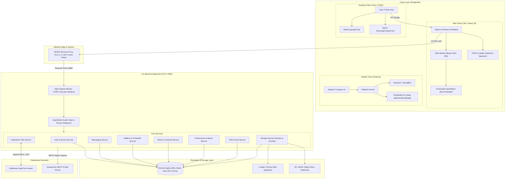
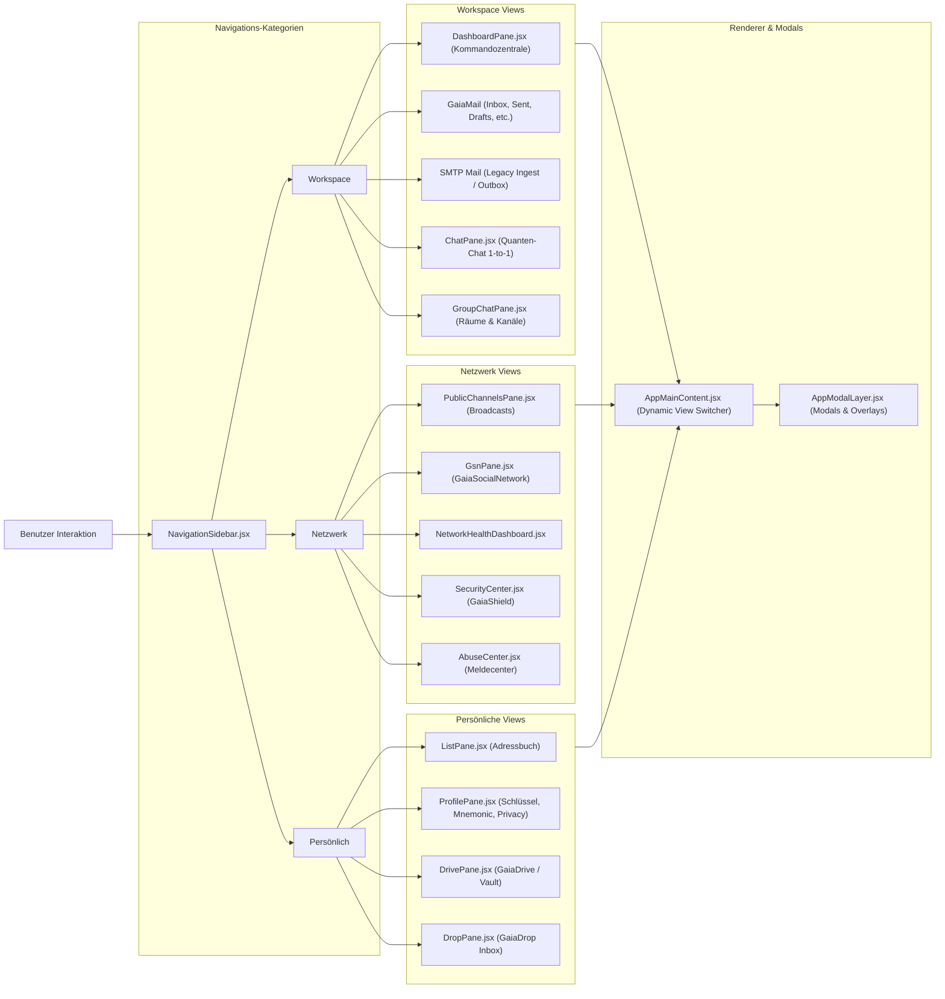
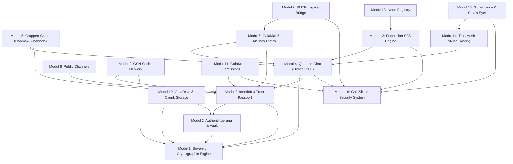
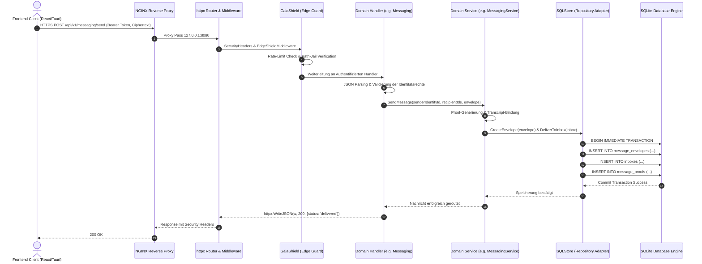

# GaiaCom Technische System- und Architekturkarte

// STATUS: PLATIN VGT SUPREME  
// REVISION: 2.0.0 Sovereign Beta v2  
// ARCHITEKTUR-DOKUMENTATION & SYSTEMATISCHER DATENBAUM

---

# Inhaltsverzeichnis (Architekturindex)

1. [Systemübersicht](#1-systemübersicht)
   - [Architekturphilosophie & Zero-Server-Trust](#11-architekturphilosophie--zero-server-trust)
   - [Laufzeitumgebungen & Technologie-Stack](#12-laufzeitumgebungen--technologie-stack)
   - [Globaler Architekturbaum](#13-globaler-architekturbaum)
2. [Dateien einer Architektur zuordnen](#2-dateien-einer-architektur-zuordnen)
   - [Frontend Client (React / Vite)](#21-frontend-client-frontendfrontend)
   - [Desktop Shell (Tauri 2 Native Client)](#22-desktop-shell-desktopclient)
   - [Sovereign Crypto Core & WebAssembly](#23-sovereign-crypto-core--webassembly)
   - [Core Rust Engine (Zero-Dependency)](#24-core-rust-engine-corerustgaiacore)
   - [Backend Application Layer (Go net/http & httpx)](#25-backend-application-layer-backend)
   - [Persistenz & SQLite-Datenbank](#26-persistenz--sqlite-datenbank)
   - [Android Embedded Node & Modular Platform](#27-android-embedded-node--modular-platform-android)
   - [Deployment, DevOps & Hardening](#28-deployment-devops--hardening-deploy)
   - [Security PoCs, Audits & Quality Gates](#29-security-pocs-audits--quality-gates-security)
3. [Modul-Dokumentation](#3-modul-dokumentation)
   - [Modul 1: Sovereign Cryptographic Engine (Dual-PQC & Multi-Cipher Cascade)](#modul-1-sovereign-cryptographic-engine-dual-pqc--multi-cipher-cascade)
   - [Modul 2: Authentifizierung, Sessions & Key Vault (GaiaVault / Auth)](#modul-2-authentifizierung-sessions--key-vault-gaiavault--auth)
   - [Modul 3: Identität, GaiaID & Trust Passport](#modul-3-identität-gaiaid--trust-passport)
   - [Modul 4: Quanten-Chat & E2EE Direct Messaging](#modul-4-quanten-chat--e2ee-direct-messaging)
   - [Modul 5: Gruppen-Chats, Räume & Kanäle (Rooms & Channels)](#modul-5-gruppen-chats-räume--kanäle-rooms--channels)
   - [Modul 6: GaiaMail & Mailbox State Management](#modul-6-gaiamail--mailbox-state-management)
   - [Modul 7: SMTP Legacy Bridge & Downgrade Gateway](#modul-7-smtp-legacy-bridge--downgrade-gateway)
   - [Modul 8: Public Channels (Öffentliche Broadcast-Kanäle)](#modul-8-public-channels-öffentliche-broadcast-kanäle)
   - [Modul 9: GSN – GaiaSocialNetwork (Dezentrales Social Layer)](#modul-9-gsn--gaiasocialnetwork-dezentrales-social-layer)
   - [Modul 10: GaiaDrive & Encrypted Chunk Storage](#modul-10-gaiadrive--encrypted-chunk-storage)
   - [Modul 11: GaiaDrop (Anonyme Text-Einreichungen)](#modul-11-gaiadrop-anonyme-text-einreichungen)
   - [Modul 12: Federation & S2S PDU-Transport](#modul-12-federation--s2s-pdu-transport)
   - [Modul 13: Node Registry & Core-Hash-Verifikation](#modul-13-node-registry--core-hash-verifikation)
   - [Modul 14: TrustMesh & Lokales Reputations-Scoring](#modul-14-trustmesh--lokales-reputations-scoring)
   - [Modul 15: Governance, Gaia's Eyes & Reviewer Workflows](#modul-15-governance-gaias-eyes--reviewer-workflows)
   - [Modul 16: GaiaShield Security Operations & Intrusion Defense](#modul-16-gaiashield-security-operations--intrusion-defense)
   - [Modul 17: Desktop Client Integration (Tauri 2 Bridge)](#modul-17-desktop-client-integration-tauri-2-bridge)
   - [Modul 18: Android Mobile Platform (Embedded Node)](#modul-18-android-mobile-platform-embedded-node)
4. [Dashboard & Workspace Detailliert Dokumentieren](#4-dashboard--workspace-detailliert-dokumentieren)
   - [Dashboard → Kommandozentrale (`/dashboard`)](#dashboard--kommandozentrale-dashboard)
   - [Dashboard → Quanten-Chat (`/chat`)](#dashboard--quanten-chat-chat)
   - [Dashboard → GaiaMail Posteingang & Ordner (`/inbox`, etc.)](#dashboard--gaiamail-posteingang--ordner-inbox-etc)
   - [Dashboard → SMTP Mailbox (`/smtp_inbox`, etc.)](#dashboard--smtp-mailbox-smtp_inbox-etc)
   - [Dashboard → Gruppen-Chats & Räume (`/groups`)](#dashboard--gruppen-chats--räume-groups)
   - [Dashboard → Public Channels (`/public_channels`)](#dashboard--public-channels-public_channels)
   - [Dashboard → GSN Social Network (`/gsn`)](#dashboard--gsn-social-network-gsn)
   - [Dashboard → Network Health (`/network_health`)](#dashboard--network-health-network_health)
   - [Dashboard → Security Center (`/security_center`)](#dashboard--security-center-security_center)
   - [Dashboard → Abuse Center (`/abuse_center`)](#dashboard--abuse-center-abuse_center)
   - [Dashboard → Adressbuch / Kontakte (`/contacts`)](#dashboard--adressbuch--kontakte-contacts)
   - [Dashboard → Mein Profil & Sicherheit (`/profile`)](#dashboard--mein-profil--sicherheit-profile)
   - [Dashboard → GaiaDrive / Vault (`/vault`)](#dashboard--gaiadrive--vault-vault)
   - [Dashboard → GaiaDrop (`/gaiadrop`)](#dashboard--gaiadrop-gaiadrop)
   - [Dashboard → Mail Composer Overlay (`isComposing`)](#dashboard--mail-composer-overlay-iscomposing)
5. [CSS & UI-Architektur](#5-css--ui-architektur)
   - [Globale Styles & Resets](#51-globale-styles--resets)
   - [Theme & Design Tokens (Dark / Light Mode)](#52-theme--design-tokens-dark--light-mode)
   - [Layout, Navigation & Panels](#53-layout-navigation--panels)
   - [Modul- & Seitenspezifische Stylesheets](#54-modul---seitenspezifische-stylesheets)
   - [Responsive Design & Mobile Dock](#55-responsive-design--mobile-dock)
   - [Visuelle Effekte: Nebula & Quantum Interface](#56-visuelle-effekte-nebula--quantum-interface)
   - [Style-Dateien & Komponenten-Matrix](#57-style-dateien--komponenten-matrix)
6. [API-Architektur & Endpunkt-Referenz](#6-api-architektur--endpunkt-referenz)
7. [Systemweite Datenflüsse](#7-systemweite-datenflüsse)
   - [Datenfluss 1: Identitätserstellung & Dual-PQC-Schlüsselgenerierung](#datenfluss-1-identitätserstellung--dual-pqc-schlüsselgenerierung)
   - [Datenfluss 2: E2EE Quanten-Chat Nachrichtensendung & -Empfang](#datenfluss-2-e2ee-quanten-chat-nachrichtensendung---empfang)
   - [Datenfluss 3: GaiaDrive Lokale Ablage & Cloud-Synchronisation](#datenfluss-3-gaiadrive-lokale-ablage--cloud-synchronisation)
   - [Datenfluss 4: S2S Föderation mit Signierten PDUs & SSRF-Schutz](#datenfluss-4-s2s-föderation-mit-signierten-pdus--ssrf-schutz)
   - [Datenfluss 5: Missbrauchsmeldung, Gaia's Eyes Grant & Reviewer-Queue](#datenfluss-5-missbrauchsmeldung-gaias-eyes-grant--reviewer-queue)
   - [Datenfluss 6: GaiaShield Sicherheitsereignis & Audit-Kette](#datenfluss-6-gaiashield-sicherheitsereignis--audit-kette)
8. [Shared & Core Komponenten](#8-shared--core-komponenten)
9. [Architektur-Relationen & Mermaid-Diagramme](#9-architektur-relationen--mermaid-diagramme)
   - [Diagramm 1: Gesamtsystem-Architektur](#diagramm-1-gesamtsystem-architektur)
   - [Diagramm 2: Dashboard- & Navigation-Architektur](#diagramm-2-dashboard---navigation-architektur)
   - [Diagramm 3: Modul-Abhängigkeitsgraph](#diagramm-3-modul-abhängigkeitsgraph)
   - [Diagramm 4: Backend / API / Datenbank-Pipeline](#diagramm-4-backend--api--datenbank-pipeline)
10. [Dateireferenzen](#10-dateireferenzen)
11. [Architektur-Auffälligkeiten & Ungenutzte Dateien](#11-architektur-auffälligkeiten--ungenutzte-dateien)

---

# 1. Systemübersicht

## 1.1 Architekturphilosophie & Zero-Server-Trust

GaiaCom ist eine **post-quanten-sichere, föderierte Kommunikationsinfrastruktur**, die nach strengen Prinzipien des **Zero-Server-Trust** und **Client-Side-Computing** arbeitet:

1. **Zero Server Trust**: Der Server (Go-Backend) fungiert ausschließlich als Transporteur, Routing-Instanz, Föderationsknoten und Speicher für verschlüsselte Envelopes (`message_envelopes`), verschlüsselte Chunks (`file_chunks`) sowie minimale Identitäts- und Audit-Metadaten. Der Server besitzt zu keinem Zeitpunkt Zugriff auf:
   - Klartext-Nachrichten oder Anhänge
   - BIP-39 Mnemonics oder private Schlüssel (X25519, ML-KEM-1024, HQC-256, Ed25519, ML-DSA-87)
   - Symmetrische Nachrichtenschlüssel oder Session-Root-Secrets
   - Entschlüsselte Inhalte des lokalen Speichers (GaiaDrive / GaiaVault)
2. **Dual-PQC Hybrid KEM**: Die Verschlüsselung basiert auf einem Drei-Geheimnis-Kombinator (`HKDF-SHA3-512`), der klassisches Ephemeral X25519, Post-Quantum ML-KEM-1024 und Post-Quantum HQC-256 vereint.
3. **Multi-Cipher Authenticated Cascade**:
   - *Accelerated Mode*: Twofish-256-EAX + AES-256-GCM (Ed25519 Signaturen)
   - *Top Secret Mode*: Vierfache Kaskade: Serpent-256-CTR-HMAC-SHA3-512 + Twofish-256-EAX + XChaCha20-Poly1305 + AES-256-GCM-SIV (Ed25519 + ML-DSA-87 Signaturen)
4. **Kein administrativer Generalschlüssel (No-Godmode)**: Weder Node-Betreiber noch Auditoren können verschlüsselte Daten rückwirkend entschlüsseln. Moderation erfolgt nachweisbasiert über kryptografische Proofs (`GaiaProof`), Offenlegungs-Token (`Gaia's Eyes`) und lokale Föderationsreputation (`TrustMesh`).
5. **Zero-Dependency Edge**: Gin und GORM wurden vollständig aus dem Backend entfernt. Das HTTP-Routing erfolgt über `Backend/httpx` (reines Go `net/http`), die Persistenz über pure-Go SQLite (`modernc.org/sqlite`).

## 1.2 Laufzeitumgebungen & Technologie-Stack

| Schicht | Technologie | Aufgabe | Quellpfad |
|---|---|---|---|
| **Web Frontend** | React 18, Vite, Web Worker | Single-Page Application, UI, kryptografischer Browser-Worker, OPFS | `Frontend/frontend/` |
| **Desktop Shell** | Tauri 2.11, Rust 1.85 | Native Desktop-App, isolated IPC, native HQC- und Kaskaden-Befehle | `DesktopClient/src-tauri/` |
| **Sovereign Crypto Core** | Rust 1.85, zeroize | Geteilte Multi-Cipher-Kaskade, native & WASM-Kompilierung | `SovereignCryptoCore/` |
| **Sovereign Crypto WASM** | Rust, wasm-pack | WebAssembly-Brücke für den Browser-Crypto-Worker | `SovereignCryptoWasm/` |
| **Core Primitives** | Rust (Zero Dependency) | Deterministische Validierung (GaiaID, Envelope, TrustMesh) | `Core/rust/gaiacore/` |
| **Backend Server** | Go 1.26.5 (Linux AMD64) | Föderation, Routing, SQLite-Persistenz, ACLs, GaiaShield, SMTP | `Backend/` |
| **In-Memory Mobile Node**| Go (`Backend/mobileapi`) | Eingebetteter Knoten für Android/iOS via Gomobile-Bridge | `Backend/mobileapi/` |
| **Android Client** | Kotlin, Jetpack Compose | Modularer nativer mobiler Knoten mit Keystore/StrongBox | `Android/` |
| **Datenbank** | SQLite (pure-Go WAL-Mode) | Lokale und serverseitige relationale Persistenz mit Triggern | `Backend/database/` |
| **Edge Proxy** | NGINX | TLS-Terminierung, CSP-Header, Reverse Proxy (:8080) | `deploy/nginx/` |
| **Service Supervisor** | systemd | Sandboxed Linux-Service mit Minimalrechten | `deploy/systemd/` |

---

## 1.3 Globaler Architekturbaum

```text
GAIACOM PLATFORM
│
├── Dashboard & Workspace (Frontend UI) [Frontend/frontend/src/]
│   ├── Layout & Navigation
│   │   ├── NavigationSidebar.jsx      (Hauptnavigation: Workspace, Netzwerk, Persönlich)
│   │   ├── ListPane.jsx               (Listenansicht: Mailbox, Räume, Kontakte, GaiaDrop, GaiaDrive)
│   │   ├── MobileNavigationDock.jsx   (Mobiles Bottom-Dock für Touch-Geräte)
│   │   ├── LogoMark.jsx               (SVG-Branding und AstraeaOS-Icon)
│   │   └── VersionBadge.jsx           (Build- und Konsensus-Indikator)
│   │
│   ├── Dashboard (Kommandozentrale)
│   │   └── DashboardPane.jsx          (Systemmetriken, Uplink-Status, PWA-Install, Schnellzugriffe)
│   │
│   ├── Workspace Panes (Kommunikationskerne)
│   │   ├── ChatPane.jsx               (Quanten-Chat: 1-to-1 E2EE PQC-Nachrichten)
│   │   ├── GroupChatPane.jsx          (Gruppen-Chats: Räume, Unterkanäle, Moderation)
│   │   ├── PublicChannelsPane.jsx     (Public Channels: Öffentliche Posts, Kommentare, Reaktionen)
│   │   ├── ReaderPane.jsx             (E-Mail-Reader: Anzeige nativer und SMTP-Mails)
│   │   └── ComposerPane.jsx           (E-Mail-Composer: Entwurfsverwaltung, Zeitplanung, SMTP-Warnung)
│   │
│   ├── Netzwerk, Sicherheit & Governance Panes
│   │   ├── GsnPane.jsx                (GaiaSocialNetwork: Dezentraler Feed, Profile, Reaktionen)
│   │   ├── NetworkHealthDashboard.jsx (Netzwerk-Gesundheit, Ping-Latenzen, Föderationsknoten)
│   │   ├── SecurityCenter.jsx         (GaiaShield: Sicherheitsereignisse, Audit-Kette, Knoten-Audit)
│   │   └── AbuseCenter.jsx            (Meldecenter: Fallberichte, Gaia's Eyes, Reviewer-Queue)
│   │
│   ├── Persönliche Bereiche & Speicher
│   │   ├── ProfilePane.jsx            (Profilverwaltung, Mnemonics, Schlüssel, Inaktivitätssperre)
│   │   ├── DrivePane.jsx              (GaiaDrive: OPFS-verschlüsselte Dateien, lokale Notizen, Cloud-Sync)
│   │   ├── DropPane.jsx               (GaiaDrop: Anonyme Text-Einreichungen & Postfach)
│   │   └── VaultPane.jsx              (Legacy GaiaVault-Notizen; abgelöst durch DrivePane)
│   │
│   ├── Modals & Dialog-Ebenen
│   │   ├── AppModalLayer.jsx          (Zentraler Modal-Manager)
│   │   ├── AppFeedbackModals.jsx      (Benutzer-Bestätigungen, Alerts, 3-Wege-Dialoge)
│   │   ├── AuthScreen.jsx             (Login, Registrierung, Kontowiederherstellung)
│   │   ├── UnlockScreen.jsx           (Sitzungsentsperrung via Passwort / PIN / WebAuthn)
│   │   ├── SetupWizard.jsx            (Ersteinrichtungs-Assistent für neue Identitäten)
│   │   ├── FirstRunOnboarding.jsx     (Einführungstour nach Erstinstallation)
│   │   ├── ContactProfileModal.jsx    (Kontakt-Detailkarte, Trust Passport, Schlüsselhistorie)
│   │   ├── AddContactModal.jsx        (Manueller Kontakt-Import via GaiaID)
│   │   ├── CreateGroupModal.jsx       (Raumerstellung mit Top-Secret-Option)
│   │   ├── JoinGroupModal.jsx         (Raumbeitritt via Hash oder Einladungslink)
│   │   ├── CreateChannelModal.jsx     (Unterkanal in bestehendem Raum erstellen)
│   │   ├── GroupSettingsModal.jsx     (Raumeinstellungen, Slow-Mode, Mitgliederverwaltung)
│   │   ├── KeyChangeWarningModal.jsx  (Sicherheitswarnung bei geändertem Empfängerschlüssel)
│   │   ├── QuantumShieldModal.jsx     (Erklärung & Statusanzeige des Quanten-Schutzes)
│   │   └── HumanProofDialog.jsx       (Kryptografischer Proof-of-Human-Nachweis)
│   │
│   └── Styling-Architektur [Frontend/frontend/src/styles/]
│       ├── 27 kaskadierende CSS-Dateien (base, theme, layout, chat, nebula, ui, etc.)
│       └── startup.css                (Kritische Pre-Hydration-Styles zur Vermeidung von FOUC)
│
├── Sovereign Cryptographic Engine (Dual-PQC & Multi-Cipher)
│   ├── SovereignCryptoCore/           (Rust-Kaskade: Twofish, AES-GCM, Serpent, XChaCha20, AES-GCM-SIV)
│   ├── SovereignCryptoWasm/           (WASM-Export für Web-Browser)
│   ├── DesktopClient/src-tauri/       (Tauri 2 Native Host mit pqcrypto-hqc & IPC-Bridge)
│   ├── Core/rust/gaiacore/            (Zero-Dependency Rust-Primitiven: GaiaID, Envelopes, TrustMesh)
│   ├── Frontend/frontend/src/sovereign/
│   │   ├── nativeProvider.js          (Desktop Tauri IPC Provider)
│   │   ├── webProvider.js             (Browser Worker & WASM Provider)
│   │   ├── webCrypto.worker.js        (Isolierter Web Worker für HQC-256 & Kaskade)
│   │   └── vendor/liboqs-hqc256/      (Lokale, herstellerunabhängige liboqs HQC-256 Runtime)
│   ├── Frontend/frontend/src/crypto.js (Klassische & PQC-Primitiven: noble-curves, scure-bip39, AES-GCM)
│   └── Backend/crypto/                (Go CIRCL ML-KEM-1024, ML-DSA-87, Ed25519)
│
├── Backend Application Services (Go 1.26.5) [Backend/]
│   ├── cmd/gaiacom/main.go            (CLI Einstiegspunkt: run, setup, doctor, version)
│   ├── main.go                        (Server Lifecycle, Graceful Shutdown, Signal Handling)
│   ├── routes.go                      (HTTP Router Setup, Middleware-Kaskade, Route-Deklaration)
│   ├── route_runtime.go               (Validierung der Laufzeitkonfiguration)
│   ├── scheduler.go                   (DraftScheduler: Zeitgesteuerter Versand von E-Mails/Nachrichten)
│   ├── httpx/                         (Framework-freies net/http Routing, CORS & Security-Header)
│   ├── auth/                          (Benutzerkonten, Argon2/PBKDF2, JWT-Signierung & -Rotation)
│   ├── devices/                       (Geräte-Sessions, Schlüssel-Revokation, QR-Pairing-Protokoll)
│   ├── identity/                      (GaiaID-Verwaltung, öffentliche Schlüsselkataloge, HumanProof)
│   ├── messaging/                     (E2EE Nachrichtentransport, Proofs, Lesebestätigungen, Reaktionen)
│   ├── mailbox/                       (Mailbox-Zustände, Ordner, Labels, Kontakte, Filterregeln, Suche)
│   ├── room/                          (Raumverwaltung, Mitgliederrollen, Beitrittsanfragen, Pins, Audit-Logs)
│   ├── publicchannels/                (Öffentliche Broadcasts, Abonnements, Moderation, Kommentare)
│   ├── gsn/                           (Soziales Netzwerk: Posts, Kommentare, Reaktionen, Profile)
│   ├── storage/                       (GaiaDrive Chunked Object Store: Local FS & S3 Adapter, Quotas)
│   ├── gaiadrop/                      (Anonyme Text-Einreichungen mit Rate-Limiting & Hash-Prüfung)
│   ├── smtpbridge/                    (Legacy SMTP-Inbound & Outbound mit Downgrade-Kennzeichnung)
│   ├── federation/                    (S2S Signed PDUs, SSRF-Firewall, Replay-Schutz, Warteschlangen-Worker)
│   ├── noderegistry/                  (Knotenregistrierung, Operator-Zulassung, Core-Hash-Integrität)
│   ├── trustmesh/                     (Lokale Reputationsbewertung, Epochen-Hashing, Missbrauchs-Friction)
│   ├── governance/                    (Bootstrap-Rollen, Meldecenter-Fälle, Gaia's Eyes Offenlegung, Berufung)
│   ├── internal/security/             (GaiaShield: Kryptografische Audit-Kette, Redaktionsfilter, IDS-Regeln)
│   ├── networkhealth/                 (Knoten-Metriken, Latenz-Pings, Dashboard-Daten)
│   ├── operations/                    (Healthchecks: /livez, /readyz, /metrics Prometheus-Monitoring)
│   ├── provision/                     (Idempotente Produktions-Initialisierung & Umgebungs-Diagnostik)
│   └── mobileapi/                     (In-Process Gomobile Bindings für native Android/iOS-Knoten)
│
├── Persistenz & Datenbank Layer [Backend/database/ & Backend/repository/]
│   ├── database/database.go           (SQLite Verbindungs-Manager, WAL-Pragmas, DDL-Migrationen)
│   ├── database/migrations.go         (Schema-Migrationsledger mit SHA-256 Prüfsummen & Backups)
│   ├── database/migration_transport_queue.go (Offline Transport-Outbox und Deduplizierungs-Tabellen)
│   ├── repository/repository.go       (Zentrale Store-Schnittstellendefinitionen)
│   ├── repository/sql_store.go        (SQLStore Konstruktor und Transaktionsverwaltung)
│   └── repository/sql_store_*.go      (25 domänenspezifische Persistenz-Adapter)
│
├── Android Mobile Platform [Android/]
│   ├── platform/contracts/            (Schnittstellenverträge zwischen Modulen)
│   ├── platform/kernel/               (App-Lifecycle, Command-Bus, Event-Dispatcher)
│   ├── platform/node/                 (Bridge zum Go-Embedded-Node via Backend/mobileapi)
│   ├── platform/security/             (Kryptografische Schnittstellen & GaiaCore Rust-JNI)
│   ├── platform/security-android/     (Android Keystore & StrongBox Hardware-Bindung)
│   ├── platform/security-auth/        (Biometrische Authentifizierung & PIN-Sperre)
│   ├── platform/runtime/              (Lokale Runtime-Verwaltung)
│   ├── platform/remote/               (Transport-Adapter für HTTP, Wi-Fi Direct, BLE)
│   ├── platform/api/                  (Typisierte Kotlin-APIs für Präsentationsschicht)
│   ├── platform/identity/             (Identitäts- und Schlüsselverwaltung auf dem Gerät)
│   └── app/                           (Android Jetpack Compose UI-Einstiegspunkt)
│
├── Deployment, DevOps & Runtime Hardening [deploy/]
│   ├── nginx/gaiacom.conf             (Gehärtetes NGINX-VHost: TLS 1.3, CSP, Frame Deny, No Sniff)
│   └── systemd/gaiacom.service        (Gehärtete Systemd-Unit: Strict Sandbox, PrivateTmp, NoNewPrivileges)
│
└── Test- & Sicherheits-Gates [security/ & scripts/]
    ├── scripts/repository_hygiene.py  (Hygiene-Scanner: Prüft Binär-Hashes, Dateigrößen & Secrets)
    ├── scripts/android_architecture_gate.py (Validiert Android-Modulabhängigkeiten)
    ├── security/master_security_suite.py (Automatisierte End-to-End Adversarial Suite)
    ├── security/poc/                  (11 isolierte Proof-of-Concept Exploit- & Integritätstests)
    └── security/extreme/              (Extrem-Last-, BOLA/BFLA- und Replay-Stresstests)
```

---

# 2. Dateien einer Architektur zuordnen

Alle Pfadangaben verstehen sich relativ zum Repository-Root (`GaiaCom-main/`).

## 2.1 Frontend Client (`Frontend/frontend/`)

### Einstiegspunkte & Konfiguration
- `Frontend/frontend/index.html`: HTML-Root-Dokument mit Content Security Policy (CSP), PWA-Manifest-Links und Startup-CSS.
- `Frontend/frontend/vite.config.js`: Vite-Bundler-Konfiguration, WASM-Support, Rollup-Bundle-Splitting.
- `Frontend/frontend/package.json`: Node-Paketdefinition (React 18, noble-curves, scure-bip39, vitest).
- `Frontend/frontend/src/index.jsx`: React 18 Root-Initialisierung, `RuntimeBoundary` (Fehlerabfang), PWA Service-Worker-Registrierung.
- `Frontend/frontend/src/index.css`: Haupt-CSS-Manifest; importiert alle 27 Einzelschnittstellen-Stylesheets.
- `Frontend/frontend/public/startup.css`: Kritisches Fallback-Styling vor der React-Hydration (verhindert FOUC).
- `Frontend/frontend/public/service-worker.js`: Offline-Caching und Asset-Verwaltung für Progressive Web Apps.

### Globale Komponenten & Orchestrierung
- `Frontend/frontend/src/App.jsx`: Haupt-Container; verwaltet Theme, Identitäten, Menü-Status, Benachrichtigungen und Socket/Polling.
- `Frontend/frontend/src/components/app/AppMainContent.jsx`: Dynamischer View-Port; lädt via `React.lazy` und `Suspense` das jeweils aktive Pane.
- `Frontend/frontend/src/components/app/AppModalLayer.jsx`: Zentraler Layer für Popups, Modals und Dialoge.
- `Frontend/frontend/src/components/app/AppFeedbackModals.jsx`: Alert-, Bestätigungs- und 3-Wege-Auswahldialoge.
- `Frontend/frontend/src/api.js`: Zentraler HTTP-API-Client mit automatischer JWT-Rotation und Desktop-Erkennung.
- `Frontend/frontend/src/crypto.js`: Web-Krypto-Engine (noble/curves, scure/bip39, PBKDF2, AES-GCM, ECDSA).
- `Frontend/frontend/src/sovereignCrypto.js`: Abstraktionsschicht für Sovereign Dual-PQC (wechselt zwischen Native und Web Worker).

### Navigation & Layout
- `Frontend/frontend/src/components/layout/NavigationSidebar.jsx`: 3-Bereiche-Seitenleiste (Workspace, Netzwerk, Persönlich), Identitätskarte, Quantum-Shield-Anzeige.
- `Frontend/frontend/src/components/layout/ListPane.jsx`: Mittlere Spalte für Nachrichtenlisten, Chat-Kontakte, Ordner und Filter.
- `Frontend/frontend/src/components/layout/MobileNavigationDock.jsx`: Touch-optimierte Navigation für Smartphones und Tablets.
- `Frontend/frontend/src/components/layout/LogoMark.jsx`: Vektorbasiertes GaiaCom-Logo.
- `Frontend/frontend/src/components/layout/VersionBadge.jsx`: Anzeige von Softwareversion und Föderationskonsens.

### Dashboard & Feature-Panes
- `Frontend/frontend/src/components/chat/DashboardPane.jsx`: System-Kommandozentrale, Uplink-Status, Schnellübersicht.
- `Frontend/frontend/src/components/chat/ChatPane.jsx`: E2EE 1-to-1 Quanten-Chat, Timeline, Dateianhänge, Reaktionen.
- `Frontend/frontend/src/components/chat/GroupChatPane.jsx`: Gruppenraum-Ansicht, Unterkanäle, Teilnehmerliste, Rollenanzeige.
- `Frontend/frontend/src/components/chat/PublicChannelsPane.jsx`: Öffentliche Broadcast-Kanäle, Posts, Reaktionen, Kommentare.
- `Frontend/frontend/src/components/chat/ReaderPane.jsx`: E-Mail-Reader, Dekodierung nativer Envelopes, GaiaProof-Verifikation.
- `Frontend/frontend/src/components/chat/ComposerPane.jsx`: E-Mail-Editor mit Betreff, Empfängern, Entwurfsspeicherung und SMTP-Schalter.
- `Frontend/frontend/src/components/chat/ProfilePane.jsx`: Schlüsselanzeige, Mnemonics, Inaktivitätstimer, Kontolöschung, Privacy.
- `Frontend/frontend/src/components/chat/DrivePane.jsx`: GaiaDrive Speicher-Manager (OPFS-Dateien, Notizen, Cloud-Sync).
- `Frontend/frontend/src/components/chat/DropPane.jsx`: GaiaDrop Einreichungspostfach und Überprüfung anonymer Einsendungen.
- `Frontend/frontend/src/components/chat/GsnPane.jsx`: GaiaSocialNetwork Feed, Beitragserstellung, Folgen/Entfolgen.
- `Frontend/frontend/src/components/chat/SecurityCenter.jsx`: GaiaShield Sicherheitszentrale, Ereignisprotokolle, Knoten-Audit.
- `Frontend/frontend/src/components/chat/AbuseCenter.jsx`: Meldecenter, Vertrauensbewertung, Reviewer-Queue, Operator-Aktionen.
- `Frontend/frontend/src/components/public/NetworkHealthDashboard.jsx`: Öffentlicher Netzwerkstatus, Ping-Zeiten, Föderationsgesundheit.
- `Frontend/frontend/src/components/chat/VaultPane.jsx`: *Legacy*: Alter Notiz-Tresor (ersetzt durch `DrivePane.jsx`).

### Authentifizierung & Onboarding
- `Frontend/frontend/src/components/auth/AuthScreen.jsx`: Authentifizierungs-Bildschirm (Login, Registrierung, Wiederherstellung).
- `Frontend/frontend/src/components/auth/UnlockScreen.jsx`: Lokale Sitzungsentsperrung (Passwort, PIN, WebAuthn PRF).
- `Frontend/frontend/src/components/auth/SetupWizard.jsx`: Assistent zur Erzeugung neuer Identitäten und Mnemonics.
- `Frontend/frontend/src/components/onboarding/FirstRunOnboarding.jsx`: Interaktive Einführung nach der Ersteinrichtung.

### Modals & Dialoge
- `Frontend/frontend/src/components/modals/AddContactModal.jsx`: Kontakt hinzufügen per GaiaID.
- `Frontend/frontend/src/components/modals/ContactProfileModal.jsx`: Kontakt-Profil, Verifikationsnachweis, Schlüsselhistorie.
- `Frontend/frontend/src/components/modals/CreateGroupModal.jsx`: Gruppenraum anlegen (mit Top-Secret-Flag).
- `Frontend/frontend/src/components/modals/JoinGroupModal.jsx`: Gruppe beitreten per Einladungscode.
- `Frontend/frontend/src/components/modals/CreateChannelModal.jsx`: Kanal in einem Raum anlegen.
- `Frontend/frontend/src/components/chat/GroupSettingsModal.jsx`: Raumverwaltung, Slow-Mode, Rollenrechte, Audit-Logs.
- `Frontend/frontend/src/components/modals/KeyChangeWarningModal.jsx`: Sicherheitswarnung bei geändertem Empfängerschlüssel.
- `Frontend/frontend/src/components/modals/QuantumShieldModal.jsx`: Details zum Dual-PQC-Schutzstatus.
- `Frontend/frontend/src/components/common/HumanProofDialog.jsx`: Erstellung eines kryptografischen Human-Proofs.
- `Frontend/frontend/src/components/common/AppModal.jsx`: Generischer modaler Container.
- `Frontend/frontend/src/components/common/GaiaPassportCard.jsx`: Visuelle Pass-Karte mit Vertrauenswerten.
- `Frontend/frontend/src/components/common/AvatarPicker.jsx`: Avatar-Auswahl und Upload-Vorbereitung.

### Frontend Custom Hooks (`Frontend/frontend/src/hooks/`)
- `useGaiaAuth.js`: Authentifizierungszustand, Tokenverwaltung, Identitätsabruf.
- `useChat.js`: Chat-Nachrichten, Polling, Senden, Entschlüsseln, Löschen, Reaktionen.
- `useDrive.jsx`: OPFS-Dateiverwaltung, lokale AES-GCM Notizen, Chunked Cloud-Uploads.
- `useEmails.js`: GaiaMail- & SMTP-Postfach-Logik, Filter, Entwürfe, Labels, Zustandsupdates.
- `usePublicChannels.js`: Öffentliche Kanäle abonnieren, Beiträge erstellen, Kommentare verwalten.
- `useGsn.js`: GSN Feed-Abruf, Beiträge veröffentlichen, Reaktionen, Profiländerungen.
- `useGaiaDrop.js`: Abruf und Bereinigung von GaiaDrop-Einreichungen.
- `usePresence.js`: Heartbeat-Senden und Online-Status-Abfrage von Kontakten.
- `useMessageMeta.js`: Pins, gespeicherte Nachrichten, Reaktionen im lokalen Speicher.
- `useUnreadMarkers.js`: Ungelesen-Markierungen und Positions-Tracking für Chats und Gruppen.
- `useChatNotifications.js`: Desktop- und Audio-Benachrichtigungen bei neuen Nachrichten.
- `useInactivityLock.js`: Automatisches Sperren der UI bei Inaktivität.
- `useKeyChangeDetection.js`: Erkennung von Manipulationsversuchen an Empfängerschlüsseln.
- `useVault.js`: *Legacy*: Alter Tresor-Hook (abgelöst durch `useDrive.jsx`).

### Frontend Hilfsprogramme (`Frontend/frontend/src/utils/`)
- `avatar.js`: Generierung und Skalierung von Avataren.
- `channelsTranslations.js`: Mehrsprachige Systemtexte für Public Channels.
- `contacts.js`: Zusammenführung von Mail- und Chat-Kontakten.
- `deviceFanout.js`: Fanout-Berechnung für Multi-Device-Verschlüsselung.
- `gaiaAddress.js`: Parsing und Validierung von `@benutzer:knoten.tld` Adressen.
- `humanProof.js`: Proof-of-Humanity Berechnungen.
- `i18n.jsx`: Mehrsprachigkeits-Engine (DE, EN, ES, FR, IT, etc.).
- `keyHistory.js`: Append-Only Tracking von verifizierten Kontaktschlüsseln.
- `markdown.jsx`: Sicheres React-Rendering von Markdown ohne `dangerouslySetInnerHTML`.
- `notificationPreferences.js`: Normalisierung von Benachrichtigungseinstellungen.
- `payload.js`: Validierung und Serialisierung von Nachrichten-Nutzlasten.
- `recovery.js`: Export und Import von verschlüsselten Wiederherstellungsdateien.
- `safeJson.js`: Abgesicherte JSON-Parsing-Funktionen gegen Prototype-Pollution.
- `secureExport.js`: Verschlüsselter Export von Systemdaten.
- `terms.js`: Nutzungsbedingungen und Datenschutzerklärungen.
- `useContactActions.js`: Hilfsfunktionen zur Kontaktpflege.
- `useProfileActions.js`: Hilfsfunktionen zur Profil- und Schlüsselverwaltung.
- `uuid.js`: RFC-4122 v4 UUID-Generierung und Prüfung.
- `webauthnPrf.js`: WebAuthn PRF-Extension für hardwaregebundene Schlüsselableitung.

---

## 2.2 Desktop Shell (`DesktopClient/`)

- `DesktopClient/src-tauri/Cargo.toml`: Tauri-Projektkonfiguration und Abhängigkeiten (`pqcrypto-hqc`, `zeroize`, `gaiacom-sovereign-core`).
- `DesktopClient/src-tauri/tauri.conf.json`: Sicherheitsgrenzen: Deaktivierter lokaler Webserver, strikte CSP, Fenstereigenschaften.
- `DesktopClient/src-tauri/capabilities/default.json`: Feingranulare Berechtigungsdeklaration für Tauri 2.
- `DesktopClient/src-tauri/src/main.rs`: Desktop-Ausführungs-Einstiegspunkt.
- `DesktopClient/src-tauri/src/lib.rs`: Registrierung der nativen IPC-Befehle im Tauri-Builder.
- `DesktopClient/src-tauri/src/sovereign_crypto.rs`: Implementierung der 5 isolierten IPC-Crypto-Befehle:
  - `sovereign_hqc256_keypair`: Generiert HQC-256 Schlüsselpaar nativ in Rust.
  - `sovereign_hqc256_encapsulate`: Erzeugt KEM-Ciphertext und Shared Secret.
  - `sovereign_hqc256_decapsulate`: Entkapselt KEM-Ciphertext mit dem privaten Schlüssel.
  - `sovereign_seal`: Führt Twofish/AES-GCM oder Vierfach-Kaskade nativ aus.
  - `sovereign_open`: Entschlüsselt Kaskaden-Ciphertext nativ in Rust.

---

## 2.3 Sovereign Crypto Core & WebAssembly

- `SovereignCryptoCore/Cargo.toml`: Rust-Crate `gaiacom-sovereign-core` v2.0.0.
- `SovereignCryptoCore/src/lib.rs`: Mathematische Implementierung der Kaskaden-Chiffren:
  - `seal()` & `open()`: Hauptfunktionen für Accelerated und Top-Secret Profile.
  - Twofish-256-EAX, AES-256-GCM, Serpent-256-CTR, HMAC-SHA3-512, XChaCha20-Poly1305, AES-256-GCM-SIV.
  - Sichere Speicherbereinigung (`zeroize`) aller temporären Schlüsselpuffer.
- `SovereignCryptoWasm/Cargo.toml`: Crate für WASM-Kompilierung via `wasm-pack`.
- `SovereignCryptoWasm/src/lib.rs`: WebAssembly-Bindings (`#[wasm_bindgen]`) zur Bereitstellung der Rust-Kaskade für Browser.
- `Frontend/frontend/src/sovereign/wasm/gaiacom_sovereign_wasm_bg.wasm`: Kompilierte WASM-Binärdatei.
- `Frontend/frontend/src/sovereign/vendor/liboqs-hqc256/hqc-256.runtime.js`: Lokale liboqs HQC-256 JavaScript/WASM-Runtime.
- `Frontend/frontend/src/sovereign/webCrypto.worker.js`: Isolierter Web Worker; führt HQC-256 Operationen und Kaskaden im Hintergrund-Thread aus.

---

## 2.4 Core Rust Engine (`Core/rust/gaiacore/`)

- `Core/rust/gaiacore/Cargo.toml`: Zero-Dependency Crate `gaiacore`.
- `Core/rust/gaiacore/src/lib.rs`: Grundlegende Invarianten:
  - `validate_gaia_id()`: RFC-konforme Prüfung von `@user:domain.tld`.
  - `constant_time_eq()`: Timing-resistenter Byte-Vergleich.
  - `is_fixed_hex()`: Sichere Hexadezimal-Validierung.
- `Core/rust/gaiacore/src/envelope.rs`: Parsing und Integritätsprüfung von Nachrichten-Envelopes.
- `Core/rust/gaiacore/src/trust_mesh.rs`: Mathematische Berechnung von Reputationswerten und Verfallskurven.

---

## 2.5 Backend Application Layer (`Backend/`)

### Hauptprogramm & Routing
- `Backend/cmd/gaiacom/main.go`: Binary Entrypoint; delegiert an `backend.Execute()`.
- `Backend/main.go`: Server-Lifecycle, Initialisierung von Config, DB und Routen, Graceful Shutdown.
- `Backend/routes.go`: Registriert alle Endpunkte, Middleware-Pipelines und Hintergrund-Worker.
- `Backend/route_runtime.go`: Lädt und validiert Umgebungsvariablen (`GAIACOM_JWT_SECRET`, etc.).
- `Backend/scheduler.go`: Hintergrunddienst für zeitverzögert geplante E-Mails und Nachrichten.
- `Backend/embedded_node.go`: Ermöglicht den In-Process-Betrieb als eingebettete Engine.
- `Backend/mobile_node_registry.go`: Verwaltet aktive Knoteninstanzen im mobilen Kontext.
- `Backend/mobile_transport_registry.go`: Registrierung verfügbarer mobiler Transportwege.

### Domänen-Pakete
- `Backend/auth/`:
  - `password.go`: RFC 9106 Argon2id Passworthashing, Timing-Attack Defense & Auto-Rehash.
  - `auth_service.go`: Benutzer-Registrierung, Argon2id-Passworthashing, JWT-Ausstellung.
  - `auth_handler.go`: HTTP-Handler für `/api/v1/auth/*`.
- `Backend/devices/`:
  - `device_service.go`: Verwaltung von Geräte-Schlüsseln, Revokation und QR-Code-Kopplung.
  - `device_handler.go`: HTTP-Handler für `/api/v1/devices/*`.
- `Backend/identity/`:
  - `identity_service.go`: CRUD für Identitäten, Veröffentlichung öffentlicher Schlüssel.
  - `identity_handler.go`: HTTP-Handler für `/api/v1/identity/*` und öffentliche Profile.
- `Backend/messaging/`:
  - `messaging_service.go`: Envelope-Validierung, E2EE Routing, Proof-Generierung.
  - `messaging_handler.go`: HTTP-Handler für `/api/v1/messaging/*`.
- `Backend/mailbox/`:
  - `service.go`: Mailbox-Ordner, Labels, Filterregeln, Adressbuch, globale Volltextsuche.
  - `handler.go`: HTTP-Handler für `/api/v1/mailbox/*` und `/api/v1/search/global`.
- `Backend/room/`:
  - `service.go`: Gruppenräume, Unterkanäle, Rollen, Einladungslinks, Beitrittsanfragen.
  - `handler.go`: HTTP-Handler für `/api/v1/rooms/*`.
- `Backend/publicchannels/`:
  - `service.go`: Öffentliche Broadcast-Kanäle, Posts, Kommentare, Reaktionen, Moderation.
  - `handler.go`: HTTP-Handler für `/api/v1/public-channels/*`.
- `Backend/gsn/`:
  - `service.go`: GaiaSocialNetwork Beiträge, Reaktionen, Kommentare, Profile, Follower.
  - `handler.go`: HTTP-Handler für `/api/v1/gsn/*`.
- `Backend/storage/`:
  - `storage_service.go`: Chunked Upload-Koordination, Quotas, Zugriffsberechtigungen (ACL).
  - `storage_handler.go`: HTTP-Handler für `/api/v1/storage/*`.
  - `object_store.go`: Dateisystem-basierter lokaler Objektspeicher mit Path-Jail-Schutz.
  - `s3_object_store.go`: S3/MinIO-kompatibler Objektspeicher-Adapter.
- `Backend/gaiadrop/`:
  - `service.go`: Anonyme Text-Einreichungen, Hash-Verifikation, Größenbegrenzung.
  - `handler.go`: HTTP-Handler für `/api/v1/gaiadrop/*` und `/api/v1/public/gaiadrop/*`.
- `Backend/smtpbridge/`:
  - `service.go`: Legacy SMTP-Gateway mit STARTTLS, Header-Sanitizing und Downgrade-Kennzeichnung.
  - `handler.go`: HTTP-Handler für `/api/v1/smtp/send` und `/api/v1/public/smtp/ingest`.
- `Backend/federation/`:
  - `federation_service.go`: Server-zu-Server Kommunikation, Signierte PDUs, Replay-Schutz.
  - `federation_handler.go`: HTTP-Handler für `/.well-known/gaiacom/*` und S2S-Forwarding.
  - `federation_types.go`: Datenstrukturen für Föderations-Transaktionen.
- `Backend/noderegistry/`:
  - `service.go`: Registrierung neuer Knoten, Operator-Zulassung, Quarantäne, Core-Hash-Abgleich.
  - `handler.go`: HTTP-Handler für `/api/v1/node/registry/*`.
- `Backend/trustmesh/`:
  - `service.go`: Proof-basierte Missbrauchsmeldungen, Reputationsabzug, Epochen-Hashing.
  - `handler.go`: HTTP-Handler für `/api/v1/reports/submit`.
- `Backend/governance/`:
  - `service.go`: Bootstrap-Operator-Rechte (`governance.json`), Gaia's Eyes Token, Reviewer-Queue.
  - `handler.go`: HTTP-Handler für `/api/v1/governance/*`, `/api/v1/reviewer/*`, `/api/v1/node/abuse/*`.
  - `bootstrap.go`: Lädt vertrauenswürdige Betreiber-Identitäten beim Systemstart.
- `Backend/internal/security/` (GaiaShield):
  - `shield.go`: Zentrales Sicherheits-Subsystem, EdgeShield-Middleware, Retention-Sweeper.
  - `audit.go`: Manipulationssichere kryptografische Audit-Kette (Hash-Chain).
  - `events.go`: Definition und Erfassung von Sicherheitsereignissen (Severity, Kategorien).
  - `privacy.go`: Automatische Maskierung und Anonymisierung sensibler Daten.
  - `security_routes.go`: HTTP-Handler für `/api/v1/security/*` und `/api/v1/node/security/*`.
- `Backend/networkhealth/`:
  - `service.go`: Uptime-Messung, Latenzprüfungen, Status der Nachbarknoten.
  - `handler.go`: HTTP-Handler für `/api/v1/public/network-health`.
- `Backend/operations/`:
  - `monitor.go`: Liveness- (`/livez`), Readiness- (`/readyz`) und Prometheus-Metriken (`/metrics`).
- `Backend/httpx/`:
  - `router.go`: Zero-Dependency HTTP-Router mit parametrisierten Pfaden.
  - `middleware.go`: Sicherheits-Header (HSTS, CSP, Framing-Schutz).
  - `cors.go`: Feingranulare CORS-Richtlinie.
  - `json.go`: Standardisierte JSON-Ausgabe und Fehler-Serialisierung.
- `Backend/crypto/`:
  - `crypto_service.go`: CIRCL ML-KEM-1024, Ed25519 und ML-DSA-87 Hilfsfunktionen.
- `Backend/models/`:
  - `models.go`: Sämtliche Go-Structs für Entitäten, API-Requests, DTOs und Datenbankzeilen.
- `Backend/buildinfo/`:
  - `buildinfo.go`: Unveränderliche Release-Metadaten (Version, Git-Commit, Build-Zeitpunkt).
- `Backend/provision/`:
  - `setup.go`: Idempotente Generierung der Produktionsumgebung (`gaiacom setup`).
  - `doctor.go`: Automatische Sicherheitsprüfung der Konfiguration (`gaiacom doctor`).

---

## 2.6 Persistenz & SQLite-Datenbank

- `Backend/database/database.go`:
  - SQLite-Initialisierung (`modernc.org/sqlite`, pure-Go, CGO-frei).
  - Erzwingt WAL-Modus (`PRAGMA journal_mode=WAL`), Fremdschlüssel (`PRAGMA foreign_keys=ON`), Busy-Timeout (10.000 ms) und Synchronous-Stufe FULL.
  - Enthält die DDL-Migrationstabelle und über 70 DDL-Statements.
- `Backend/database/migrations.go`:
  - Deterministischer Schema-Migrations-Manager.
  - Führt vor jeder anstehenden Migration ein atomares SQLite-Backup durch (`backupDatabaseBeforeMigration`).
- `Backend/database/migration_transport_queue.go`:
  - Schema für die Offline-Transport-Outbox (`transport_outbox`) und Deduplizierung (`transport_inbox_dedup`).
- `Backend/repository/repository.go`:
  - Interfaces: `Store`, `AuthStore`, `MessagingStore`, `StorageStore`, `GovernanceStore`, etc.
- `Backend/repository/sql_store.go`:
  - Hauptadapter `SQLStore`, kapselt `*sql.DB` und Transaktions-Helfer.
- `Backend/repository/sql_store_*.go`:
  - 25 domänenspezifische Implementierungsdateien:
    - `sql_store_auth.go`: Benutzer, Sitzungen, Passwörter.
    - `sql_store_devices.go` / `sql_store_device_keys.go`: Geräte und Pairings.
    - `sql_store_identity.go`: Identitäten, Human-Proofs.
    - `sql_store_messaging.go`: Envelopes, Inboxes, Proofs, Lesebestätigungen, Reaktionen.
    - `sql_store_mailbox.go`: Mailbox-Zustände, Entwürfe, Labels, Filter, Suche.
    - `sql_store_rooms_public_channels.go`: Räume, Kanäle, Mitgliedschaften, Moderation.
    - `sql_store_public_channel_interactions.go`: Public Channel Posts, Reaktionen, Kommentare.
    - `sql_store_gsn.go`: Posts, Kommentare, Reaktionen, Profile, Follower.
    - `sql_store_storage_gaiadrop.go`: Datei-Metadaten, Chunks, Zugriffsrechte, Drop-Submissions.
    - `sql_store_federation.go`: Server-Liste, Queue, S2S-Routing.
    - `sql_store_federation_replay.go`: Replay-Prüfung für eingehende PDUs.
    - `sql_store_governance_abuse.go`: Richtlinien, Rollenbeglaubigungen, Fälle, Offenlegungen.
    - `sql_store_security_events.go`: GaiaShield Sicherheitsereignisse & Audit-Chain.
    - `sql_store_rate_limit.go`: Rate-Limiting-Zähler im SQLite-Speicher.
    - `sql_store_presence.go`: Heartbeat- und Online-Zustände.
    - `sql_store_transport_queue.go`: Multi-Hop Offline-Warteschlange.

---

## 2.7 Android Embedded Node & Modular Platform (`Android/`)

- `Android/settings.gradle.kts`: Gradle-Multi-Modul-Struktur:
  - `:app`: Nativer Jetpack-Compose Client.
  - `:platform:contracts`: Schnittstellen für Entkopplung aller Feature-Module.
  - `:platform:kernel`: Anwendungs-Kernel, Command-/Event-Bus, Zustandsverwaltung.
  - `:platform:node`: In-Process JNI-Bridge zum Go-Backend (`Backend/mobileapi`).
  - `:platform:security`: Abstrakte Sicherheits- und Krypto-Schnittstellen.
  - `:platform:security-android`: Hardwaregestützte Schlüsselspeicherung in Android Keystore / StrongBox.
  - `:platform:security-auth`: Biometrische Authentifizierung (Fingerabdruck / Face Unlock).
  - `:platform:runtime`: Lifecycle- und Hintergrund-Dienststeuerung.
  - `:platform:remote`: Transportverbindungen (Internet, Wi-Fi Direct, Bluetooth Mesh).
  - `:platform:api`: Typisierte Kotlin-Fassade für Präsentationsschichten.
  - `:platform:identity`: Lokale Identitäts- und Adressbuchverwaltung.
- `Android/build.gradle.kts`: Zentrale Build-Konfiguration.

---

## 2.8 Deployment, DevOps & Hardening (`deploy/`)

- `deploy/nginx/gaiacom.conf`:
  - Gehärteter NGINX Reverse-Proxy.
  - Leitet `/api/v1/`, `/.well-known/gaiacom/`, `/livez` und `/readyz` an den lokalen Backend-Port `:8080` weiter.
  - Blockiert direkten Zugriff auf `/metrics` von extern.
  - Schützt statische Frontend-Dateien durch strikte Header: `X-Frame-Options: DENY`, `X-Content-Type-Options: nosniff`, `Content-Security-Policy`.
- `deploy/systemd/gaiacom.service`:
  - Gehärtete systemd-Service-Unit für Linux AMD64.
  - `ProtectSystem=strict`, `ProtectHome=true`, `PrivateTmp=true`, `PrivateDevices=true`.
  - `NoNewPrivileges=true`, `LockPersonality=true`, `RestrictSUIDSGID=true`.
  - Berechtigungslose Ausführung unter dem Systembenutzer `gaiacom:gaiacom` mit `UMask=0077`.

---

## 2.9 Security PoCs, Audits & Quality Gates (`security/` & `scripts/`)

- `scripts/repository_hygiene.py`: Verhindert das Einchecken privater Schlüssel, unerlaubter Binärdateien, Logs oder Passwörter (überprüft 653+ Dateien).
- `scripts/android_architecture_gate.py`: Überprüft strikte Einhaltung der Android-Modulgrenzen.
- `security/master_security_suite.py`: Führt die gesamte automatisierte Sicherheitsprüfung aus.
- `security/total_system_poc_runner.py`: Orchestriert systemweite PoC-Angriffsszenarien.
- `security/poc/`:
  - `poc/federation/`: Testet SSRF-Schutz, IP-Sperren, ungültige Signaturen und Replay-Angriffe.
  - `poc/gaiadrop/`: Testet Payload-Größenlimits, XSS-Filterung und Rate-Limits.
  - `poc/gaiaproof/`: Verifiziert Unverfälschbarkeit von GaiaProof-Zertifikaten.
  - `poc/gaiarooms-pro/`: Testet Raumzugriffsberechtigungen, Rolleneskalation und Top-Secret-Integrität.
  - `poc/gaiavault/`: Verifiziert die Unlesbarkeit clientseitig verschlüsselter Datensätze auf dem Server.
  - `poc/governance/`: Testet Rollen-Credentials, Signaturketten und Schwellenwert-Konsens.
  - `poc/key-history/`: Überprüft Erkennung manipulierter Empfängerschlüssel (Downgrade-Schutz).
  - `poc/secure-disclosure/`: Testet zeitlich befristete Offenlegung über Gaia's Eyes Token.
  - `poc/smtp-bridge/`: Testet Schutz vor CRLF-Injection und strikte Downgrade-Signalisierung.
  - `poc/total-system/`: Gesamtsystem-Härtungstest.
  - `poc/trust-passport/`: Validierung der Reputationsmetriken gegen Fälschungen.
- `security/extreme/`: Extrem-Stresstests für parallele Datenbank-Schreibzugriffe und BOLA/BFLA-Angriffe.

---

# 3. Modul-Dokumentation

## Modul 1: Sovereign Cryptographic Engine (Dual-PQC & Multi-Cipher Cascade)

### Zweck
Dieses Modul bildet das fundamentale kryptografische Fundament von GaiaCom. Es garantiert die Vertraulichkeit, Authentizität und Post-Quanten-Sicherheit aller Nachrichten, Dateien und Identitäten.

### Fähigkeiten
- **Dual-PQC Hybrid KEM**: Kombiniert ephemeral X25519 (klassisch), ML-KEM-1024 (FIPS 203) und HQC-256 (NIST PQC Round 4) über HKDF-SHA3-512 zu einem gemeinsamen Root-Secret.
- **Sovereign Accelerated Cascade**: Authentifizierte Verschlüsselung mittels Twofish-256-EAX und AES-256-GCM; signiert mit Ed25519.
- **Sovereign Top Secret Cascade**: Vierfache authentifizierte Kaskade: Serpent-256-CTR-HMAC-SHA3-512 + Twofish-256-EAX + XChaCha20-Poly1305 + AES-256-GCM-SIV; dual signiert mit Ed25519 und ML-DSA-87 (FIPS 204).
- **Transcript Binding**: Kryptografische Bindung aller Metadaten (Version, Sender, Empfänger, Message-ID, Zeitstempel, Algorithmen-Suite) an den Ciphertext via AAD.
- **Fail-Closed Provider-Architektur**: Wechselt nahtlos zwischen Tauri-Native-Host und isoliertem Web Worker; blockiert sofort bei fehlenden Primitiven.

### Zugehörige Dateien
```text
Frontend:
- Frontend/frontend/src/sovereignCrypto.js
- Frontend/frontend/src/crypto.js
- Frontend/frontend/src/sovereign/webProvider.js
- Frontend/frontend/src/sovereign/nativeProvider.js
- Frontend/frontend/src/sovereign/webCrypto.worker.js
- Frontend/frontend/src/sovereign/wasm/gaiacom_sovereign_wasm.js
- Frontend/frontend/src/sovereign/vendor/liboqs-hqc256/hqc-256.runtime.js

Desktop Shell:
- DesktopClient/src-tauri/src/sovereign_crypto.rs
- DesktopClient/src-tauri/src/lib.rs

Sovereign Core (Rust):
- SovereignCryptoCore/src/lib.rs
- SovereignCryptoWasm/src/lib.rs

Core Primitives (Rust):
- Core/rust/gaiacore/src/lib.rs
- Core/rust/gaiacore/src/envelope.rs

Backend:
- Backend/crypto/crypto_service.go
- Backend/crypto/kyber.go
- Backend/crypto/types/crypto_types.go

Tests:
- Frontend/frontend/src/adversarial.test.js
- Frontend/frontend/src/hqc-smoke.js
- SovereignCryptoCore/tests / DesktopClient/src-tauri/tests
```

### Dashboard-Integration
- **Verwendet in**: `ChatPane.jsx`, `GroupChatPane.jsx`, `ComposerPane.jsx`, `ReaderPane.jsx`, `DrivePane.jsx`.
- **Visuelle Indikatoren**: `QuantumShieldModal.jsx`, Badge `HQC-256 + ML-KEM-1024 VERIFIED` in `DashboardPane.jsx`, Sicherheitsstatus in `NavigationSidebar.jsx`.
- **Benutzeraktionen**: Umschalten zwischen *Accelerated* und *Top Secret* Modus im Chat; Anzeige des kryptografischen Prüfzertifikats.

### Abhängigkeiten
```text
Sovereign Cryptographic Engine
├── benötigt WebAssembly & Web Worker Runtime im Browser
├── benötigt pqcrypto-hqc & gaiacom-sovereign-core im Desktop-Client
├── benötigt cloudflare/circl im Backend (ML-KEM / ML-DSA)
└── exportiert Primitiven an Messaging, Storage, GSN und Drive
```

### Wird verwendet von
- Modul 2 (Authentifizierung & Key Vault)
- Modul 4 (Quanten-Chat)
- Modul 5 (Gruppen-Chats)
- Modul 6 (GaiaMail)
- Modul 9 (GSN Social)
- Modul 10 (GaiaDrive)

---

## Modul 2: Authentifizierung, Sessions & Key Vault (GaiaVault / Auth)

### Zweck
Verwaltet Benutzerkonten, die sichere clientseitige Generierung und Verwahrung von Schlüsseln (Key Vault), Sitzungstoken (JWT-Access und Refresh-Token) sowie die Kopplung neuer Geräte via QR-Code.

### Fähigkeiten
- Kontoregistrierung mit Argon2id-Passworthashing auf dem Server und PBKDF2/BIP-39 Schlüsselableitung im Client.
- Sichere Sitzungsverwaltung über kurzlebige JWT-Access-Tokens und langlebige Refresh-Tokens mit automatischer Rotation.
- Geräte-Kopplung (Device Pairing) über ephemere Einmalgeheimnisse ohne Übertragung privater Schlüssel.
- Inaktivitätssperre mit lokaler Wiederentsperrung via Passwort, PIN oder WebAuthn PRF (Hardware-Token).

### Zugehörige Dateien
```text
Frontend:
- Frontend/frontend/src/components/auth/AuthScreen.jsx
- Frontend/frontend/src/components/auth/UnlockScreen.jsx
- Frontend/frontend/src/components/auth/SetupWizard.jsx
- Frontend/frontend/src/hooks/useGaiaAuth.js
- Frontend/frontend/src/hooks/useInactivityLock.js
- Frontend/frontend/src/utils/webauthnPrf.js
- Frontend/frontend/src/utils/recovery.js

Backend:
- Backend/auth/password.go
- Backend/auth/auth_service.go
- Backend/auth/auth_handler.go
- Backend/devices/device_service.go
- Backend/devices/device_handler.go

API:
- POST /api/v1/auth/register, /login, /refresh, /logout, /change-password, /delete-account
- GET /api/v1/auth/status, /devices
- POST /api/v1/devices/pairings, /devices/pairings/:id/approve, /consume

Datenbank:
- users, identities, device_sessions, device_pairings, device_keys
```

### Dashboard-Integration
- Nach dem Login Einstieg in `DashboardPane.jsx`.
- Entsperrung via `UnlockScreen.jsx` bei Inaktivität.
- Sitzungsverwaltung in `ProfilePane.jsx` (aktive Geräte einsehen und widerrufen).

### Abhängigkeiten
```text
Authentifizierung & Vault
├── verwendet Modul 1 (Sovereign Crypto) für Schlüsselableitung
├── liest/schreibt Tabellen: users, identities, device_sessions, device_keys
└── verwendet Shared Component: api.js, safeJson.js
```

### Wird verwendet von
- Allen Modulen des Gesamtsystems (Zugangsvoraussetzung).

---

## Modul 3: Identität, GaiaID & Trust Passport

### Zweck
Ermöglicht die dezentrale Adressierung von Kommunikationspartnern im Format `@username:node.domain.tld`, stellt kryptografische Identitätsnachweise bereit und verwaltet den Trust Passport.

### Fähigkeiten
- Parsing und Validierung föderierter GaiaIDs (`gaiaAddress.js` & `Core/rust/gaiacore/src/lib.rs`).
- Verwaltung öffentlicher Schlüsselkataloge (X25519 Box-Key, ML-KEM-1024 Key, HQC-256 Key, Ed25519 Sign-Key, ML-DSA-87 Sign-Key).
- HumanProof-Verifikation: Kryptografischer Nachweis menschlicher Interaktion.
- Trust Passport: Aggregierte Vertrauens- und Reputationsmetriken eines Nutzers.
- Key Change Detection: Warnung bei Änderung des Empfängerschlüssels zur Abwehr von Man-in-the-Middle-Angriffen.

### Zugehörige Dateien
```text
Frontend:
- Frontend/frontend/src/components/common/GaiaPassportCard.jsx
- Frontend/frontend/src/components/common/HumanProofDialog.jsx
- Frontend/frontend/src/components/modals/ContactProfileModal.jsx
- Frontend/frontend/src/components/modals/KeyChangeWarningModal.jsx
- Frontend/frontend/src/hooks/useKeyChangeDetection.js
- Frontend/frontend/src/utils/gaiaAddress.js
- Frontend/frontend/src/utils/humanProof.js
- Frontend/frontend/src/utils/keyHistory.js

Backend:
- Backend/identity/identity_service.go
- Backend/identity/identity_handler.go

API:
- POST /api/v1/identity/create, /human-proof
- GET /api/v1/identity/me, /public/identity/:gaiaID, /public/trust-passport/:gaiaID

Datenbank:
- identities, user_notification_preferences
```

### Dashboard-Integration
- Anzeige der aktiven Identität in `NavigationSidebar.jsx` und `DashboardPane.jsx`.
- Adressbuch-Detailansicht in `ContactProfileModal.jsx`.

### Abhängigkeiten
```text
Identität & Trust Passport
├── benötigt Backend/identity & Core/rust/gaiacore
├── schreibt identities Tabelle
└── stellt Identitätsinformationen für alle Kommunikationsmodule bereit
```

### Wird verwendet von
- Modul 4 (Quanten-Chat), Modul 5 (Gruppen), Modul 6 (GaiaMail), Modul 9 (GSN), Modul 15 (Governance).

---

## Modul 4: Quanten-Chat & E2EE Direct Messaging

### Zweck
Ermöglicht direkte Ende-zu-Ende-verschlüsselte 1-zu-1-Kommunikation mit Dual-PQC-Schlüsselaustausch, Lesebestätigungen, Echtzeit-Präsenz und Reaktionen.

### Fähigkeiten
- Post-quanten-sichere Verschlüsselung jeder Chat-Nachricht auf dem sendenden Gerät.
- Server speichert ausschließlich unlesbare Envelopes (`message_envelopes`) und Zustellnachweise.
- Unterstützung für *Accelerated* und *Top Secret* Sicherheitsstufen.
- Echtzeit-Präsenzerkennung (Online-Status und Tipp-Indikatoren).
- Nachträgliches Bearbeiten (`/messaging/edit`), Löschen (`/messaging/delete`) und Reaktionen (`/messaging/reaction`).
- Generierung von `GaiaProof`-Zertifikaten zur Nachweiserbringung bei Missbrauch.

### Zugehörige Dateien
```text
Frontend:
- Frontend/frontend/src/components/chat/ChatPane.jsx
- Frontend/frontend/src/components/chat/MessageActions.jsx
- Frontend/frontend/src/hooks/useChat.js
- Frontend/frontend/src/hooks/usePresence.js
- Frontend/frontend/src/hooks/useMessageMeta.js
- Frontend/frontend/src/hooks/useUnreadMarkers.js

Backend:
- Backend/messaging/messaging_service.go
- Backend/messaging/messaging_handler.go
- Backend/presence/service.go
- Backend/presence/handler.go

API:
- POST /api/v1/messaging/send, /read, /edit, /reaction, /delete, /clear
- GET /api/v1/messaging/inbox, /proof
- POST /api/v1/presence/heartbeat, /typing; GET /presence/status, /typing

Datenbank:
- message_envelopes, inboxes, message_proofs, delivery_receipts, message_read_receipts, message_reactions, identity_presence
```

### Dashboard-Integration
- Menüpunkt `chat` öffnet `ChatPane.jsx`.
- Anzeige ungelesener Direktnachrichten in `NavigationSidebar.jsx`.
- Schnellzugriff auf kürzliche Konversationen in `DashboardPane.jsx`.

### Abhängigkeiten
```text
Quanten-Chat
├── verwendet Modul 1 (Sovereign Crypto) für KEM & Kaskaden
├── verwendet Modul 3 (Identität) für Empfängerschlüssel
├── liest/schreibt message_envelopes, inboxes, message_proofs
└── bindet GaiaDrive für Dateifreigaben ein
```

### Wird verwendet von
- Endnutzern zur vertraulichen Direktkommunikation.

---

## Modul 5: Gruppen-Chats, Räume & Kanäle (Rooms & Channels)

### Zweck
Stellt Multi-User-Gruppenräume mit rollenbasierter Zugriffskontrolle, Unterkanälen, Beitrittsanfragen, Einladungslinks und Moderationsprotokollen bereit.

### Fähigkeiten
- Räume mit mehreren thematischen Textkanälen (`channels`).
- Rollenhierarchie: `owner`, `admin`, `moderator`, `member`.
- Private und öffentliche Räume mit Beitrittsanfragen (`room_join_requests`).
- Zeitgesteuerte und nutzungsbeschränkte Einladungslinks (`room_invite_links`).
- Angeheftete Nachrichten (`room_pinned_messages`) und Slow-Mode-Drosselung.
- Unveränderliche Revisions- und Moderationsprotokolle (`room_moderation_logs`).

### Zugehörige Dateien
```text
Frontend:
- Frontend/frontend/src/components/chat/GroupChatPane.jsx
- Frontend/frontend/src/components/chat/GroupSettingsModal.jsx
- Frontend/frontend/src/components/modals/CreateGroupModal.jsx
- Frontend/frontend/src/components/modals/JoinGroupModal.jsx
- Frontend/frontend/src/components/modals/CreateChannelModal.jsx

Backend:
- Backend/room/service.go
- Backend/room/handler.go

API:
- POST /api/v1/rooms/create, /update, /join, /leave, /delete, /channels, /members/role, /members/kick, /transfer-ownership
- POST /api/v1/rooms/pins/toggle, /invites/create, /invites/join, /join-requests/create, /join-requests/moderate
- GET /api/v1/rooms, /channels, /search, /pins, /join-requests, /moderation-logs

Datenbank:
- rooms, room_members, channels, room_pinned_messages, room_invite_links, room_join_requests, room_moderation_logs
```

### Dashboard-Integration
- Menüpunkt `groups` lädt `GroupChatPane.jsx`.
- Raumübersicht und Schnellbeitritt in `DashboardPane.jsx`.

### Abhängigkeiten
```text
Gruppen-Chats
├── verwendet Modul 4 (Messaging) für Nachrichten-Envelopes
├── liest/schreibt Tabellen: rooms, room_members, channels
└── interagiert mit Modul 16 (GaiaShield) bei Moderationsaktionen
```

---

## Modul 6: GaiaMail & Mailbox State Management

### Zweck
Implementiert ein vollwertiges, clientseitig verschlüsseltes E-Mail-System (GaiaMail) mit Ordnern, Labels, serverseitigem Scheduling und globaler Suche.

### Fähigkeiten
- Ordnerverwaltung: Posteingang, Entwürfe, Gesendet, Markiert, Wichtig, Snoozed, Archiv, Spam, Papierkorb.
- Benutzerdefinierte farbige Labels (`mail_labels`).
- Zeitgesteuerter Versand von E-Mails über den `DraftScheduler`.
- Automatisierte Filterregeln (`mail_filter_rules`) basierend auf Absender und Betreff.
- Globale datenschutzkonforme Suche (`/api/v1/search/global`).

### Zugehörige Dateien
```text
Frontend:
- Frontend/frontend/src/components/layout/ListPane.jsx (Mailbox-Modus)
- Frontend/frontend/src/components/chat/ReaderPane.jsx
- Frontend/frontend/src/components/chat/ComposerPane.jsx
- Frontend/frontend/src/hooks/useEmails.js

Backend:
- Backend/mailbox/service.go
- Backend/mailbox/handler.go
- Backend/scheduler.go

API:
- GET /api/v1/mailbox/messages, /drafts, /labels, /contacts, /filters, /settings, /search/global
- POST /api/v1/mailbox/state, /drafts/save, /drafts/delete, /labels/save, /contacts/save, /filters/save, /settings

Datenbank:
- mailbox_states, mail_drafts, mail_labels, mail_contacts, mail_filter_rules, mail_settings
```

### Dashboard-Integration
- Aufruf über Dropdown `GaiaMail` in `NavigationSidebar.jsx`.
- Neueste ungelesene Nachrichten werden im Widget von `DashboardPane.jsx` angezeigt.

---

## Modul 7: SMTP Legacy Bridge & Downgrade Gateway

### Zweck
Ermöglicht den Austausch mit klassischen E-Mail-Systemen über SMTP unter explizitem Hinweis auf den Verlust der nativen GaiaCom-Sicherheitsgarantien.

### Fähigkeiten
- Ausgehender E-Mail-Versand via STARTTLS mit striktem CRLF- und Header-Injection-Schutz.
- Eingehender Webhook `/api/v1/public/smtp/ingest` mit Token-Authentifizierung.
- Explizite Kennzeichnung aller SMTP-Nachrichten als `untrusted` im Frontend.
- Permanenter Warnhinweis im Composer bei Auswahl des SMTP-Modus.

### Zugehörige Dateien
```text
Frontend:
- Frontend/frontend/src/components/layout/NavigationSidebar.jsx (SMTP-Dropdown)
- Frontend/frontend/src/components/chat/ComposerPane.jsx (SMTP-Modus & Warnung)

Backend:
- Backend/smtpbridge/service.go
- Backend/smtpbridge/handler.go

API:
- POST /api/v1/smtp/send
- POST /api/v1/public/smtp/ingest
```

### Dashboard-Integration
- Eigener Navigationsbereich `SMTP Mail` in `NavigationSidebar.jsx`.
- Farbliche Differenzierung durch Warnabzeichen (`smtp-badge`).

---

## Modul 8: Public Channels (Öffentliche Broadcast-Kanäle)

### Zweck
Bietet offene, abonnierbare Informationskanäle für Ankündigungen, Diskussionsstränge, Medien und Community-Updates.

### Fähigkeiten
- Erstellung öffentlicher Kanäle mit Name, Beschreibung, Avatar und Kategorien.
- Abonnieren (`subscribe`) und Deabonnieren (`unsubscribe`).
- Veröffentlichung von Beiträgen mit Formatierung, Medienanhängen und Zeitplanung (`scheduled_for`).
- Emoji-Reaktionen und mehrstufige Kommentarstränge mit Moderationsoptionen.
- Kanal-Blockierung und thematische Discovery-Suche (`/discover`).

### Zugehörige Dateien
```text
Frontend:
- Frontend/frontend/src/components/chat/PublicChannelsPane.jsx
- Frontend/frontend/src/hooks/usePublicChannels.js

Backend:
- Backend/publicchannels/service.go
- Backend/publicchannels/handler.go

API:
- GET /api/v1/public-channels, /posts, /discover
- POST /api/v1/public-channels/create, /update, /comments, /delete, /subscribe, /unsubscribe, /block, /unblock
- POST /api/v1/public-channels/posts/create, /reaction, /comment, /pin, /comments/delete, /comments/moderate

Datenbank:
- public_channels, public_channel_admins, public_channel_subscribers, public_channel_posts, public_channel_post_reactions, public_channel_post_comments, public_channel_blocks
```

---

## Modul 9: GSN – GaiaSocialNetwork (Dezentrales Social Layer)

### Zweck
Ein dezentrales, föderationsfähiges soziales Netzwerk für Microblogging, Status-Updates und Community-Interaktionen.

### Fähigkeiten
- Erstellung kryptografisch signierter Beiträge (`gsn_posts`) mit optionalen Bildanhängen.
- Node-Feed (lokaler Server) und Following-Feed (abonnierte Kontakte).
- Signierte Kommentare (`gsn_post_comments`) und Emoji-Reaktionen.
- Benutzerprofile mit verifizierten Statusabzeichen (Betreiber, Governance, Passport).
- Clientseitige Entschlüsselung von Avataren und Beitragsbildern (`DecryptedAvatar.jsx`, `DecryptedGsnImage.jsx`).

### Zugehörige Dateien
```text
Frontend:
- Frontend/frontend/src/components/chat/GsnPane.jsx
- Frontend/frontend/src/components/chat/gsn/GsnPostCard.jsx
- Frontend/frontend/src/components/chat/gsn/GsnPostComposer.jsx
- Frontend/frontend/src/components/chat/gsn/GsnProfileEditor.jsx
- Frontend/frontend/src/components/chat/gsn/DecryptedAvatar.jsx
- Frontend/frontend/src/components/chat/gsn/DecryptedGsnImage.jsx
- Frontend/frontend/src/hooks/useGsn.js

Backend:
- Backend/gsn/service.go
- Backend/gsn/handler.go

API:
- POST /api/v1/gsn/posts, /posts/:id/react, /posts/:id/comment, /follow, /unfollow, /profile
- GET /api/v1/gsn/feed/node, /feed/following, /posts/:id/comments, /profile/:gaia_id
- DELETE /api/v1/gsn/posts/:id, /posts/:id/comments/:commentId

Datenbank:
- gsn_posts, gsn_post_comments, gsn_post_reactions, gsn_follows, gsn_profiles
```

---

## Modul 10: GaiaDrive & Encrypted Chunk Storage

### Zweck
Kombiniert lokale verschlüsselte Dateispeicherung im Browser (Origin Private File System - OPFS) mit optionaler Ende-zu-Ende-verschlüsselter Cloud-Synchronisation über das Backend.

### Fähigkeiten
- Lokale Speicherung von Notizen und Dateien in OPFS; verschlüsselt mit AES-GCM (Schlüssel im geschützten Index).
- Cloud-Upload in 1-MB-Blöcken (`file_chunks`) mit SHA-256 Hash-Validierung.
- Serverseitige Speicherquoten pro Benutzer (`GAIACOM_STORAGE_USER_QUOTA_BYTES`).
- Automatische Ablaufbereinigung temporärer Uploads (14-Tage-Cloud-TTL via Retention-Sweeper).
- Pluggable Storage Backend: Lokales Dateisystem mit Path-Jail oder S3-kompatibler Objektspeicher.

### Zugehörige Dateien
```text
Frontend:
- Frontend/frontend/src/components/chat/DrivePane.jsx
- Frontend/frontend/src/hooks/useDrive.jsx

Backend:
- Backend/storage/storage_service.go
- Backend/storage/storage_handler.go
- Backend/storage/object_store.go
- Backend/storage/s3_object_store.go

API:
- POST /api/v1/storage/init, /chunk, /complete, /grant
- GET /api/v1/storage/download/:fileId

Datenbank:
- file_metadata, file_access_grants, file_chunks
```

---

## Modul 11: GaiaDrop (Anonyme Text-Einreichungen)

### Zweck
Ermöglicht externen oder nicht authentifizierten Personen, vertrauliche Textnachrichten sicher an eine GaiaID zu übermitteln (Whistleblower- / Drop-Kanal).

### Fähigkeiten
- Öffentlicher Einreichungs-Endpunkt `/api/v1/public/gaiadrop/submit`.
- Strikte Größenbeschränkung (max. 64 KB), XSS-Sanitization und IP-basiertes Rate-Limiting.
- Empfänger liest und verwaltet Einreichungen im geschützten `DropPane.jsx`.

### Zugehörige Dateien
```text
Frontend:
- Frontend/frontend/src/components/chat/DropPane.jsx
- Frontend/frontend/src/hooks/useGaiaDrop.js

Backend:
- Backend/gaiadrop/service.go
- Backend/gaiadrop/handler.go

API:
- POST /api/v1/public/gaiadrop/submit
- GET /api/v1/gaiadrop/inbox
- POST /api/v1/gaiadrop/read, /delete

Datenbank:
- gaia_drop_submissions
```

---

## Modul 12: Federation & S2S PDU-Transport

### Zweck
Verbindet unabhängige GaiaCom-Server zu einem dezentralen Netzwerk durch kryptografisch signierte Protokolldateneinheiten (Protocol Data Units - PDUs).

### Fähigkeiten
- Server-zu-Server-Autorisierung über Header:  
  `Authorization: X-Gaia-S2S-V1 Signature="...",KeyId="node.example.org",Timestamp="..."`
- SSRF- und DNS-Rebinding-Firewall: Blockiert `localhost`, RFC 1918 Privatbereiche und Loopbacks.
- Replay-Schutz durch Transaktions-Cache (`federation_replay_guard`).
- Asynchrone Föderations-Warteschlange (`federation_queues`) mit exponentiellem Backoff und Lease-Locking.

### Zugehörige Dateien
```text
Frontend:
- Frontend/frontend/src/components/public/NetworkHealthDashboard.jsx

Backend:
- Backend/federation/federation_service.go
- Backend/federation/federation_handler.go
- Backend/federation/federation_types.go

API:
- GET /.well-known/gaiacom/server, /nodeinfo, /nodes
- POST /.well-known/gaiacom/s2s/v1/forward, /_gaiacom/s2s/v1/forward
- GET /api/v1/public/nodes

Datenbank:
- federation_servers, federation_queues, federation_replay_guard
```

---

## Modul 13: Node Registry & Core-Hash-Verifikation

### Zweck
Kontrolliertes Onboarding neuer Server-Knoten, Erkennung von Software-Forks und Gewährleistung der Versionskompatibilität im Netzwerk.

### Fähigkeiten
- Öffentlicher Ping-Endpunkt zur Anmeldung neuer Server.
- Status-Workflow für Betreiber: `pending` → `accepted`, `quarantined` oder `blocked`.
- Automatischer Abgleich des `GAIACOM_CORE_HASH` zur Erkennung veralteter oder modifizierter Server-Kerne.

### Zugehörige Dateien
```text
Frontend:
- Frontend/frontend/src/components/chat/SecurityCenter.jsx (Reiter Nodesystem)

Backend:
- Backend/noderegistry/service.go
- Backend/noderegistry/handler.go

API:
- POST /api/v1/public/node-registry/ping
- GET /api/v1/public/node-registry/nodes
- GET /api/v1/node/registry/summary
- POST /api/v1/node/registry/secrets, /ping-main, /:domain/status

Datenbank:
- node_registry_entries
```

---

## Modul 14: TrustMesh & Lokales Reputations-Scoring

### Zweck
Lokale, nachweisbasierte Erkennung und Drosselung von Spam und bösartigem Verhalten ohne Verletzung der Ende-zu-Ende-Verschlüsselung.

### Fähigkeiten
- Erstellung kryptografischer Missbrauchsmeldungen (`reports`) gebunden an Chiffrat-Hashes und Epochen-Geheimnisse.
- Lokale Reputationsabzüge (`abuse_scores`) mit Verfallskurve (Score Decay).
- Progressive Reibung (Friction): Dynamische Drosselung der Durchsatzrate verdächtiger Absender bis hin zur Quarantäne.

### Zugehörige Dateien
```text
Frontend:
- Frontend/frontend/src/components/chat/ReaderPane.jsx (Melden-Funktion)

Backend:
- Backend/trustmesh/service.go
- Backend/trustmesh/handler.go
- Core/rust/gaiacore/src/trust_mesh.rs

API:
- POST /api/v1/reports/submit

Datenbank:
- reports, abuse_scores
```

---

## Modul 15: Governance, Gaia's Eyes & Reviewer Workflows

### Zweck
Rollenbasierte Verwaltung von Vorfällen und Missbrauchsmeldungen über Reviewer-Gremien, begrenzte Fall-Offenlegung und Transparenzberichte.

### Fähigkeiten
- Schwellenwert-Konsens für Reviewer (`Senior Reviewer`, `Trusted Reviewer`, `Node Operator`).
- Bootstrap-Verankerung über `governance.json` und kryptografische `role_credentials`.
- Gaia's Eyes: Einmalige, zeitlich und im Umfang streng begrenzte Offenlegungs-Token für Beweismaterial in Missbrauchsfällen.
- Berufungsverfahren (`abuse_appeals`) gegen Sanktionen.
- Veröffentlichung manipulationsfester Transparenz-Snapshots (`transparency_snapshots`).

### Zugehörige Dateien
```text
Frontend:
- Frontend/frontend/src/components/chat/AbuseCenter.jsx

Backend:
- Backend/governance/service.go
- Backend/governance/handler.go
- Backend/governance/bootstrap.go

API:
- GET /api/v1/governance/roles, /reports/mine, /reports/:caseID, /reviewer/cases, /node/abuse/queue, /public/transparency
- POST /api/v1/reports, /reports/:caseID/disclosures, /reports/:caseID/appeal, /gaias-eyes/grants, /reviewer/cases/:caseID/review, /node/abuse/actions, /node/transparency/snapshot, /public/gaias-eyes/consume

Datenbank:
- governance_policies, role_credentials, role_credential_revocations, abuse_cases, abuse_case_events, abuse_disclosure_packages, abuse_disclosure_requests, gaias_eyes_grants, abuse_reviews, abuse_actions, abuse_appeals, federation_abuse_signals, transparency_snapshots
```

---

## Modul 16: GaiaShield Security Operations & Intrusion Defense

### Zweck
Internes Sicherheits- und Überwachungssystem zum Schutz der Knoten-Integrität, Abwehr von Angriffen und manipulationssicheren Auditierung.

### Fähigkeiten
- EdgeShield: Vor-Routing-Inspektion zur Abwehr von Path-Traversal, DoS und Header-Manipulationen.
- Kryptografische Audit-Kette (`security_audit_chain`): Hash-verkettetes, unveränderliches Audit-Log geschützt durch SQLite-Trigger.
- Datenschutzkonforme Schwärzung (`privacy.go`): Entfernt IP-Adressen und sensible Payload-Daten vor der Protokollierung.
- Intrusion-Detection-Regeln (`security_rules`, `security_rule_hits`) mit automatischer Quarantäne.

### Zugehörige Dateien
```text
Frontend:
- Frontend/frontend/src/components/chat/SecurityCenter.jsx

Backend:
- Backend/internal/security/shield.go
- Backend/internal/security/audit.go
- Backend/internal/security/events.go
- Backend/internal/security/privacy.go
- Backend/internal/security/security_routes.go
- Backend/internal/security/*_guard.go

API:
- GET /api/v1/public/security/health, /security/me/summary, /security/me/events, /security/me/report, /node/security/summary, /node/security/events
- POST /api/v1/security/me/events/:event_id/acknowledge

Datenbank:
- security_events, security_event_private_context, security_rules, security_rule_hits, security_user_acknowledgements, security_quarantines, security_audit_chain, security_rate_limits
- Trigger: trg_security_events_immutable_update, trg_security_events_no_delete, trg_security_audit_chain_no_update, trg_security_audit_chain_no_delete
```

---

## Modul 17: Desktop Client Integration (Tauri 2 Bridge)

### Zweck
Stellt die native Desktop-Laufzeitumgebung für Windows, macOS und Linux bereit und kapselt kryptografische Operationen in einem isolierten Rust-Prozess.

### Fähigkeiten
- Kein lokaler HTTP-Port: Kommunikation erfolgt ausschließlich über den nativen Tauri-IPC-Kanal.
- Ausführung von HQC-256 und Multi-Cipher-Kaskaden in kompilierter Maschinensprache ohne WebAssembly-Overhead.
- Strikte Content Security Policy (CSP) und Verbot von `unsafe-eval`.

### Zugehörige Dateien
```text
Frontend:
- Frontend/frontend/src/sovereign/nativeProvider.js

Desktop Shell:
- DesktopClient/src-tauri/Cargo.toml
- DesktopClient/src-tauri/tauri.conf.json
- DesktopClient/src-tauri/src/lib.rs
- DesktopClient/src-tauri/src/sovereign_crypto.rs
```

---

## Modul 18: Android Mobile Platform (Embedded Node)

### Zweck
Ermöglicht den Betrieb als vollwertiger mobiler Kommunikationsknoten mit hardwaregestützter Sicherheit und Offline-Fähigkeit.

### Fähigkeiten
- In-Process-Betrieb des Go-Backends ohne offenen Netzwerk-Port (`Backend/mobileapi/node.go`).
- Modulare Android-Architektur: Trennung von Präsentation (Compose), Kernel, Sicherheit und Transport.
- Hardware-Bindung an Android Keystore und StrongBox Keymaster.
- Offline-Multi-Hop-Transport über Internet, Wi-Fi Direct und Bluetooth Low Energy.

### Zugehörige Dateien
```text
Android:
- Android/settings.gradle.kts
- Android/platform/contracts/
- Android/platform/kernel/
- Android/platform/node/
- Android/platform/security-android/
- Android/platform/security-auth/
- Android/app/

Backend In-Memory Bridge:
- Backend/mobileapi/node.go
- Backend/mobileapi/bootstrap.go
- Backend/mobileapi/identity.go
- Backend/mobileapi/transport.go
```

---

# 4. Dashboard & Workspace Detailliert Dokumentieren

Alle Dashboard- und Workspace-Ansichten werden im Frontend zentral über den Zustandswechsel von `currentMenu` in `Frontend/frontend/src/App.jsx` und den Renderer `AppMainContent.jsx` geschaltet.

---

### Dashboard → Kommandozentrale (`/dashboard`)

- **Interner Menü-Status**: `currentMenu === 'dashboard'`
- **Frontend-Datei**: `Frontend/frontend/src/components/chat/DashboardPane.jsx`
- **CSS / Styling**: `Frontend/frontend/src/styles/dashboard.css`, `nebula.css`, `quantum-interface.css`
- **Verwendete Komponenten**: `LogoMark`, `VersionBadge`, Metrik-Karten, Schnellzugriffs-Grid, PWA-Install-Banner.
- **Zuständiges Modul**: Modul 1 (Sovereign Crypto), Modul 2 (Auth), Modul 4 (Messaging), Modul 5 (Rooms).
- **API-Aufrufe**: Keine direkten HTTP-Calls beim Rendern; nutzt den im Speicher synchronisierten State von `useEmails`, `useChat`, `useGaiaAuth` und `/api/v1/auth/status`.
- **Backend Handler**: `auth.GetStatus`, `operations.Liveness`.
- **Services**: `auth.AuthService`, `operations.Monitor`.
- **Datenbankzugriffe**: Tabellen `users`, `identities`, `device_sessions`.
- **Authentifizierung / Berechtigungen**: Authentifizierter Benutzer mit gültigem JWT-Token.
- **Datenfluss**:

```text
Benutzer öffnet Dashboard
        ↓
App.jsx initialisiert DashboardPane.jsx
        ↓
Aggregiert State (Identität, ungelesene Mails, aktive Räume, Chat-Metriken)
        ↓
Rendert Uplink-Status, PQC-Sicherheitslevel & Schnellzugriffe
        ↓
Benutzer klickt Aktion (z.B. Chat öffnen) → Schaltet currentMenu um
```

---

### Dashboard → Quanten-Chat (`/chat`)

- **Interner Menü-Status**: `currentMenu === 'chat'`
- **Frontend-Datei**: `Frontend/frontend/src/components/chat/ChatPane.jsx`
- **CSS / Styling**: `Frontend/frontend/src/styles/chat.css`, `responsive.css`, `nebula.css`
- **Verwendete Komponenten**: `MessageActions.jsx`, Emoji-Picker, Datei-Upload-Indikator, TopSecret-Toggle.
- **Zuständiges Modul**: Modul 4 (Quanten-Chat) in Kooperation mit Modul 1 (Sovereign Crypto).
- **API-Aufrufe**:
  - Senden: `POST /api/v1/messaging/send`
  - Abrufen: `GET /api/v1/messaging/inbox`
  - Gelesen: `POST /api/v1/messaging/read`
  - Reaktion: `POST /api/v1/messaging/reaction`
  - Löschen: `POST /api/v1/messaging/delete`
  - Präsenz: `POST /api/v1/presence/heartbeat`, `GET /api/v1/presence/status`
- **Backend Handler**: `messaging.MessagingHandler.*`, `presence.PresenceHandler.*`.
- **Services**: `messaging.MessagingService`, `presence.PresenceService`, `security.SecuritySystem`.
- **Datenbankzugriffe**: Tabellen `message_envelopes`, `inboxes`, `message_proofs`, `message_reactions`, `identity_presence`.
- **Authentifizierung**: JWT Bearer Token + Prüfung der Identitäts-Inhaberschaft (`senderIdentityId`).
- **Datenfluss**:

```text
Benutzer sendet Nachricht im Chat
        ↓
ChatPane.jsx / useChat.js
        ↓
sovereignCrypto.js (Dual-PQC KEM + Twofish/AES-GCM oder Vierfach-Kaskade)
        ↓
POST /api/v1/messaging/send (Nur Ciphertext-Envelope)
        ↓
Backend: MessagingHandler.SendMessage()
        ↓
MessagingService.SaveAndRouteEnvelope()
        ↓
SQLStore: Insert in message_envelopes & inboxes
        ↓
JSON Response (Status: queued / delivered)
        ↓
Empfänger-Client pollt GET /api/v1/messaging/inbox
        ↓
Empfänger-Worker entschlüsselt Envelope clientseitig via HQC/ML-KEM
        ↓
Anzeige im ChatPane des Empfängers
```

---

### Dashboard → GaiaMail Posteingang & Ordner (`/inbox`, etc.)

- **Interner Menü-Status**: `currentMenu === 'inbox' | 'sent' | 'drafts' | 'starred' | 'important' | 'archive' | 'trash'`
- **Frontend-Datei**: `Frontend/frontend/src/components/layout/ListPane.jsx` & `Frontend/frontend/src/components/chat/ReaderPane.jsx`
- **CSS / Styling**: `Frontend/frontend/src/styles/listpane.css`, `reader.css`, `product-refresh.css`
- **Verwendete Komponenten**: E-Mail-Listenzeilen, Ordnernavigation, Sterne-Schalter, Label-Verwaltung.
- **Zuständiges Modul**: Modul 6 (GaiaMail) & Modul 1 (Crypto).
- **API-Aufrufe**:
  - `GET /api/v1/mailbox/messages?identityId=...&folder=...`
  - `POST /api/v1/mailbox/state`
  - `GET /api/v1/messaging/proof?messageId=...`
- **Backend Handler**: `mailbox.Handler.ListMessages`, `mailbox.Handler.UpdateStates`, `messaging.MessagingHandler.GetMessageProof`.
- **Services**: `mailbox.Service`, `messaging.MessagingService`.
- **Datenbankzugriffe**: Tabellen `mailbox_states`, `message_envelopes`, `message_proofs`.
- **Authentifizierung**: JWT Bearer Token.
- **Datenfluss**:

```text
Benutzer wählt Ordner (z.B. Inbox)
        ↓
ListPane.jsx triggert getMailboxMessages()
        ↓
GET /api/v1/mailbox/messages
        ↓
Backend: mailbox.Handler -> mailbox.Service
        ↓
SQLStore: Query mailbox_states JOIN message_envelopes
        ↓
Client empfängt Envelopes und entschlüsselt Betreff/Body im Web Worker
        ↓
Auswahl einer Mail lädt ReaderPane.jsx
        ↓
Prüfung der kryptografischen Signatur & Anzeige des GaiaProof-Siegels
```

---

### Dashboard → SMTP Mailbox (`/smtp_inbox`, etc.)

- **Interner Menü-Status**: `currentMenu === 'smtp_inbox' | 'smtp_sent' | 'smtp_trash' | ...`
- **Frontend-Datei**: `Frontend/frontend/src/components/layout/ListPane.jsx` & `Frontend/frontend/src/components/chat/ReaderPane.jsx`
- **CSS / Styling**: `Frontend/frontend/src/styles/listpane.css`, `reader.css`, `gaiadrop.css`
- **Verwendete Komponenten**: Gelbe Warnbanner für Legacy-Transport, Absenderüberprüfung.
- **Zuständiges Modul**: Modul 7 (SMTP Bridge).
- **API-Aufrufe**: `GET /api/v1/mailbox/messages?untrusted=true`.
- **Backend Handler**: `mailbox.Handler.ListMessages`.
- **Services**: `mailbox.Service`, `smtpbridge.Service`.
- **Datenbankzugriffe**: Tabellen `mailbox_states`, `message_envelopes`.
- **Authentifizierung**: JWT Bearer Token.
- **Datenfluss**:

```text
Externe Mail trifft am SMTP-Gateway ein
        ↓
POST /api/v1/public/smtp/ingest (Header-Prüfung, SPF/DKIM)
        ↓
SMTPBridgeService: Speichert Envelope mit untrusted = 1
        ↓
Client ruft SMTP-Liste über ListPane.jsx ab
        ↓
ReaderPane.jsx blendet strikten Downgrade-Warnhinweis ein
```

---

### Dashboard → Gruppen-Chats & Räume (`/groups`)

- **Interner Menü-Status**: `currentMenu === 'groups'`
- **Frontend-Datei**: `Frontend/frontend/src/components/chat/GroupChatPane.jsx`
- **CSS / Styling**: `Frontend/frontend/src/styles/groupchat.css`, `chat.css`
- **Verwendete Komponenten**: Kanalliste, Teilnehmerleiste, Rollen-Manager, Slow-Mode-Timer, Anheftungs-Manager.
- **Zuständiges Modul**: Modul 5 (Gruppen-Chats) & Modul 4 (Messaging).
- **API-Aufrufe**:
  - `GET /api/v1/rooms`, `/rooms/channels`, `/rooms/pins`
  - `POST /api/v1/rooms/channels`, `/rooms/members/role`, `/rooms/pins/toggle`
  - `POST /api/v1/messaging/send` (Channel Envelope)
- **Backend Handler**: `room.Handler.*`, `messaging.MessagingHandler.SendMessage`.
- **Services**: `room.Service`, `messaging.MessagingService`.
- **Datenbankzugriffe**: Tabellen `rooms`, `room_members`, `channels`, `room_pinned_messages`, `message_envelopes`.
- **Authentifizierung**: JWT Bearer Token + Prüfung der Raum-Mitgliedschaft und Rollenberechtigung.
- **Datenfluss**:

```text
Benutzer wählt Raum und Kanal aus
        ↓
GroupChatPane.jsx ruft Kanal-Nachrichten ab
        ↓
Clientseitige Entschlüsselung der Gruppen-Envelopes
        ↓
Nachrichtenversand via POST /api/v1/messaging/send (mit channel_id)
        ↓
Backend prüft Schreibberechtigung & Slow-Mode
        ↓
Speicherung in message_envelopes mit Fanout an Raum-Inboxes
```

---

### Dashboard → Public Channels (`/public_channels`)

- **Interner Menü-Status**: `currentMenu === 'public_channels'`
- **Frontend-Datei**: `Frontend/frontend/src/components/chat/PublicChannelsPane.jsx`
- **CSS / Styling**: `Frontend/frontend/src/styles/publicChannels.css`
- **Verwendete Komponenten**: Feed-Karten, Post-Editor, Kommentarstränge, Discovery-Dialog.
- **Zuständiges Modul**: Modul 8 (Public Channels).
- **API-Aufrufe**:
  - `GET /api/v1/public-channels`, `/posts`, `/discover`
  - `POST /api/v1/public-channels/posts/create`, `/posts/reaction`, `/posts/comment`
- **Backend Handler**: `publicchannels.Handler.*`.
- **Services**: `publicchannels.Service`.
- **Datenbankzugriffe**: Tabellen `public_channels`, `public_channel_posts`, `public_channel_post_reactions`, `public_channel_post_comments`.
- **Authentifizierung**: JWT Bearer Token.

---

### Dashboard → GSN Social Network (`/gsn`)

- **Interner Menü-Status**: `currentMenu === 'gsn'`
- **Frontend-Datei**: `Frontend/frontend/src/components/chat/GsnPane.jsx`
- **CSS / Styling**: `Frontend/frontend/src/styles/gsn.css`
- **Verwendete Komponenten**: `GsnPostCard`, `GsnPostComposer`, `GsnProfileEditor`, `DecryptedAvatar`, `DecryptedGsnImage`.
- **Zuständiges Modul**: Modul 9 (GSN).
- **API-Aufrufe**:
  - `GET /api/v1/gsn/feed/node`, `/feed/following`, `/profile/:gaia_id`
  - `POST /api/v1/gsn/posts`, `/posts/:id/react`, `/posts/:id/comment`, `/follow`
- **Backend Handler**: `gsn.Handler.*`.
- **Services**: `gsn.Service`, `federation.Service`.
- **Datenbankzugriffe**: Tabellen `gsn_posts`, `gsn_post_comments`, `gsn_post_reactions`, `gsn_follows`, `gsn_profiles`.
- **Authentifizierung**: JWT Bearer Token + Ed25519 Beitragssignatur.

---

### Dashboard → Network Health (`/network_health`)

- **Interner Menü-Status**: `currentMenu === 'network_health'`
- **Frontend-Datei**: `Frontend/frontend/src/components/public/NetworkHealthDashboard.jsx`
- **CSS / Styling**: `Frontend/frontend/src/styles/networkHealth.css`
- **Verwendete Komponenten**: Status-Kacheln, Latenz-Graphen, Föderations-Tabelle.
- **Zuständiges Modul**: Modul 12 (Federation) & Modul 16 (Operations).
- **API-Aufrufe**: `GET /api/v1/public/network-health`, `GET /api/v1/public/version`.
- **Backend Handler**: `networkhealth.Handler.Dashboard`.
- **Services**: `networkhealth.Service`.
- **Datenbankzugriffe**: Tabellen `federation_servers`, `node_registry_entries`.
- **Authentifizierung**: Öffentlich zugänglich (kein Token erforderlich).

---

### Dashboard → Security Center (`/security_center`)

- **Interner Menü-Status**: `currentMenu === 'security_center'`
- **Frontend-Datei**: `Frontend/frontend/src/components/chat/SecurityCenter.jsx`
- **CSS / Styling**: `Frontend/frontend/src/styles/security.css`
- **Verwendete Komponenten**: Audit-Log-Tabelle, Ereignis-Anerkennungs-Button, Knoten-System-Monitor, Secret-Generator.
- **Zuständiges Modul**: Modul 16 (GaiaShield) & Modul 13 (Node Registry).
- **API-Aufrufe**:
  - `GET /api/v1/security/me/summary`, `/events`, `/report`
  - `POST /api/v1/security/me/events/:event_id/acknowledge`
  - Betreiber: `GET /api/v1/node/security/summary`, `/events`, `/node/registry/summary`
- **Backend Handler**: `security.SecurityHandler.*`, `noderegistry.Handler.*`.
- **Services**: `security.SecuritySystem`, `noderegistry.Service`.
- **Datenbankzugriffe**: Tabellen `security_events`, `security_audit_chain`, `node_registry_entries`.
- **Authentifizierung**: JWT Bearer Token; Betreiber-Rechte erfordern `governance.json`-Verifikation.

---

### Dashboard → Abuse Center (`/abuse_center`)

- **Interner Menü-Status**: `currentMenu === 'abuse_center'`
- **Frontend-Datei**: `Frontend/frontend/src/components/chat/AbuseCenter.jsx`
- **CSS / Styling**: `Frontend/frontend/src/styles/abuseCenter.css`
- **Verwendete Komponenten**: Vorfalls-Warteschlange, Fall-Details, Beweis-Entschlüsseler, Schwellenwert-Abstimmung.
- **Zuständiges Modul**: Modul 15 (Governance) & Modul 14 (TrustMesh).
- **API-Aufrufe**:
  - `GET /api/v1/governance/roles`, `/reports/mine`, `/reviewer/cases`, `/node/abuse/queue`
  - `POST /api/v1/reports`, `/reviewer/cases/:caseID/review`, `/node/abuse/actions`
- **Backend Handler**: `governance.Handler.*`.
- **Services**: `governance.Service`.
- **Datenbankzugriffe**: Tabellen `abuse_cases`, `abuse_reviews`, `abuse_actions`, `role_credentials`.
- **Authentifizierung**: JWT Bearer Token + Prüfung der Reviewer-/Operator-Rolle.

---

### Dashboard → Adressbuch / Kontakte (`/contacts`)

- **Interner Menü-Status**: `currentMenu === 'contacts'`
- **Frontend-Datei**: `Frontend/frontend/src/components/layout/ListPane.jsx` & `ContactProfileModal.jsx`
- **CSS / Styling**: `Frontend/frontend/src/styles/listpane.css`, `modals.css`
- **Verwendete Komponenten**: Kontaktkarten, Trust-Badge, Schlüssel-Fingerprint, Notizen.
- **Zuständiges Modul**: Modul 3 (Identität) & Modul 6 (Mailbox).
- **API-Aufrufe**: `GET /api/v1/mailbox/contacts`, `POST /api/v1/mailbox/contacts/save`, `GET /api/v1/public/identity/:gaiaID`.
- **Backend Handler**: `mailbox.Handler.*`, `identity.IdentityHandler.GetPublicIdentity`.
- **Services**: `mailbox.Service`, `identity.IdentityService`.
- **Datenbankzugriffe**: Tabellen `mail_contacts`, `identities`.

---

### Dashboard → Mein Profil & Sicherheit (`/profile`)

- **Interner Menü-Status**: `currentMenu === 'profile'`
- **Frontend-Datei**: `Frontend/frontend/src/components/chat/ProfilePane.jsx`
- **CSS / Styling**: `Frontend/frontend/src/styles/profile.css`, `auth.css`
- **Verwendete Komponenten**: Passwortwechsel-Formular, Mnemonic-Aufdeckungs-Modal, PIN-/WebAuthn-Schalter, Session-Liste.
- **Zuständiges Modul**: Modul 2 (Auth) & Modul 3 (Identität).
- **API-Aufrufe**: `POST /api/v1/auth/change-password`, `/privacy`, `/delete-account`, `GET /api/v1/auth/devices`.
- **Backend Handler**: `auth.AuthHandler.*`.
- **Services**: `auth.AuthService`.
- **Datenbankzugriffe**: Tabellen `users`, `identities`, `device_sessions`.

---

### Dashboard → GaiaDrive / Vault (`/vault`)

- **Interner Menü-Status**: `currentMenu === 'vault'`
- **Frontend-Datei**: `Frontend/frontend/src/components/chat/DrivePane.jsx`
- **CSS / Styling**: `Frontend/frontend/src/styles/drive.css`
- **Verwendete Komponenten**: OPFS-Dateimanager, Notiz-Editor, Cloud-Sync-Statusanzeige, Upload-Fortschrittsbalken.
- **Zuständiges Modul**: Modul 10 (GaiaDrive).
- **API-Aufrufe**:
  - `POST /api/v1/storage/init`
  - `POST /api/v1/storage/chunk`
  - `POST /api/v1/storage/complete`
  - `GET /api/v1/storage/download/:fileId`
- **Backend Handler**: `storage.StorageHandler.*`.
- **Services**: `storage.Service`, `object_store.*`.
- **Datenbankzugriffe**: Tabellen `file_metadata`, `file_chunks`, `file_access_grants`.

---

### Dashboard → GaiaDrop (`/gaiadrop`)

- **Interner Menü-Status**: `currentMenu === 'gaiadrop'`
- **Frontend-Datei**: `Frontend/frontend/src/components/chat/DropPane.jsx`
- **CSS / Styling**: `Frontend/frontend/src/styles/gaiadrop.css`
- **Verwendete Komponenten**: Einreichungsliste, Integritäts-Hash-Prüfer, Detailbetrachter.
- **Zuständiges Modul**: Modul 11 (GaiaDrop).
- **API-Aufrufe**: `GET /api/v1/gaiadrop/inbox`, `POST /api/v1/gaiadrop/read`, `POST /api/v1/gaiadrop/delete`.
- **Backend Handler**: `gaiadrop.Handler.*`.
- **Services**: `gaiadrop.Service`.
- **Datenbankzugriffe**: Tabelle `gaia_drop_submissions`.

---

### Dashboard → Mail Composer Overlay (`isComposing`)

- **Interner Zustand**: `isComposing === true`
- **Frontend-Datei**: `Frontend/frontend/src/components/chat/ComposerPane.jsx`
- **CSS / Styling**: `Frontend/frontend/src/styles/reader.css`, `ui.css`
- **Verwendete Komponenten**: Rich-Text-Editor, Empfänger-Autovervollständigung, SMTP-Toggle, Dateianhangs-Vorschau.
- **Zuständiges Modul**: Modul 6 (GaiaMail) & Modul 7 (SMTP Bridge).
- **API-Aufrufe**: `POST /api/v1/messaging/send`, `POST /api/v1/smtp/send`, `POST /api/v1/mailbox/drafts/save`.
- **Backend Handler**: `messaging.MessagingHandler.SendMessage`, `smtpbridge.Handler.Send`, `mailbox.Handler.SaveDraft`.

---

# 5. CSS & UI-Architektur

Die Styling-Architektur von GaiaCom basiert auf einem rein modularen CSS-Kaskadensystem ohne externe CSS-Frameworks wie Tailwind oder Bootstrap. Alle Styles werden in `Frontend/frontend/src/index.css` über `@import`-Regeln in einer genau abgestimmten Reihenfolge zusammengeführt.

## 5.1 Globale Styles & Resets
- `base.css`: CSS-Reset, globale Box-Sizing-Regeln, Typografie-Basis (Inter / Roboto), Scrollbalken-Styling (`gaia-scrollbar`).
- `startup.css`: Vorab geladene Styles im HTML-Header; rendert den Fehlerbildschirm (`astraea-startup--fault`) und Ladezustände ohne FOUC.

## 5.2 Theme & Design Tokens (Dark / Light Mode)
- `theme.css`: Definiert CSS-Custom-Properties auf `:root`, `.dark-mode` und `.light-mode`:
  - Akzentfarben: `--accent-cyan: #00f2fe;`, `--accent-blue: #4facfe;`, `--accent-purple: #654ff0;`
  - Statusfarben: `--success: #2ed573;`, `--warning: #ffa502;`, `--danger: #ff4757;`
  - Oberflächen: `--bg-primary: #0a0e17;`, `--bg-secondary: #111827;`, `--card-bg: rgba(17, 24, 39, 0.7);`
  - Unschärfen & Schatten: `--glass-blur: blur(16px);`, `--panel-shadow: 0 8px 32px 0 rgba(0, 0, 0, 0.37);`
- `product-refresh.css`: Veredelte Rahmenradien, konsistente Polsterungen und Sub-Pixel-Glow-Effekte.

## 5.3 Layout, Navigation & Panels
- `layout.css`: 3-Spalten-Grid-Architektur:
  - Spalte 1: `.navigation-sidebar` (260px)
  - Spalte 2: `.mail-list-pane` (320px, einklappbar)
  - Spalte 3: `.mail-content-pane` (flex-grow: 1)
- `ui.css`: Wiederverwendbare UI-Primitives: Buttons (`.primary-btn`, `.secondary-btn`), Badges, Inputs, Form-Groups.
- `modals.css`: Modaler Hintergrund (`.modal-backdrop`), zentrierte Container (`.modal-container`), Animationen.

## 5.4 Modul- & Seitenspezifische Stylesheets
- `dashboard.css`: Kachel-Raster (`.dashboard-grid-cards`), Uplink-Status, Schnellzugriffskarten.
- `chat.css`: Chat-Blasen (`.chat-bubble.sent`, `.received`), Audio-/Dateianhänge, Reaktions-Picker, Zitat-Balken.
- `groupchat.css`: Spezifische Overrides für Gruppen-Chats, Raum-Kopfzeile, Moderationsleiste.
- `reader.css`: E-Mail-Leseansicht, Kopfzeilen-Metadaten, Dateianhang-Karten, Composer-Formular.
- `drive.css`: GaiaDrive Baumstruktur, OPFS-Dateiliste, Verschlüsselungsindikatoren, Cloud-Status.
- `profile.css`: Profilkarten, Mnemonic-Aufdeckungsraster, Schalter für Inaktivität und Privatsphäre.
- `publicChannels.css`: Social-Broadcast-Feed, Post-Karten, Kommentar-Threads, Discovery-Kacheln.
- `gsn.css`: GSN Social Feed, Microblogging-Composer, verifizierte Pass-Badges, Bildgitter.
- `auth.css`: Anmelde-, Registrierungs- und Entsperrkarten mit animierten Hintergrund-Gradienten.
- `onboarding.css`: Schritt-für-Schritt-Assistent für Erstbenutzer.
- `security.css`: GaiaShield Ereignis-Logs, Ampel-Statusanzeigen, Betreiber-Audit-Tabellen.
- `abuseCenter.css`: Meldecenter-Fälle, Beweisprüfer, Schwellenwert-Abstimmungsbalken.
- `networkHealth.css`: Föderationsstatus-Tabellen, Ping-Latenz-Anzeigen.
- `gaiadrop.css`: Einreichungsformulare und Postfach-Listen für anonyme Einreichungen.
- `vault.css`: *Legacy*: Älteres Styling für gesperrte Notiz-Karten.

## 5.5 Responsive Design & Mobile Dock
- `responsive.css`: Media-Queries für Bildschirme unter 992px und 600px:
  - Einklappen der Seitenspalten zu Off-Canvas-Drawern (`.mobile-menu-open`).
  - Einblenden des unteren mobilen Docks (`.mobile-navigation-dock`).
  - Touch-optimierte Mindesthöhen (min. 34px / 44px) für Buttons.
- `stability-refresh.css`: Defensive Layout-Regeln, Scroll-Anchoring, Verhindern horizontaler Überläufe auf Mobilgeräten.

## 5.6 Visuelle Effekte: Nebula & Quantum Interface
- `nebula.css`: Futuristische visuelle Effekte: Glassmorphismus, animierte Chrome-Rahmen (`.nebula-content-chrome`), Leucht-Glows.
- `quantum-interface.css`: Quantenkryptografie-Visualisierungen: Pulsierende Schutzschilde, Algorithmen-Pills (`HQC-256`, `ML-KEM-1024`).

## 5.7 Style-Dateien & Komponenten-Matrix

| CSS-Datei | Beeinflusste Komponenten & Views |
|---|---|
| `base.css` | Globales DOM, `App.jsx`, alle Panes |
| `theme.css` | Globales Farbschema, Dark/Light Mode Schalter |
| `ui.css` | `AppFeedbackModals.jsx`, `AppModal.jsx`, alle Buttons und Formulare |
| `layout.css` | `NavigationSidebar.jsx`, `ListPane.jsx`, `AppMainContent.jsx` |
| `auth.css` | `AuthScreen.jsx`, `UnlockScreen.jsx`, `SetupWizard.jsx` |
| `landing.css` | Landing-Page, Hero-Banner, Begrüßungsansichten |
| `listpane.css` | `ListPane.jsx`, Ordnerlisten, Kontaktlisten, Raumlisten |
| `reader.css` | `ReaderPane.jsx`, `ComposerPane.jsx` |
| `chat.css` | `ChatPane.jsx`, `MessageActions.jsx` |
| `groupchat.css` | `GroupChatPane.jsx`, `GroupSettingsModal.jsx` |
| `drive.css` | `DrivePane.jsx` (GaiaDrive) |
| `vault.css` | `VaultPane.jsx` (Legacy) |
| `profile.css` | `ProfilePane.jsx`, `ContactProfileModal.jsx` |
| `networkHealth.css` | `NetworkHealthDashboard.jsx` |
| `publicChannels.css` | `PublicChannelsPane.jsx`, `CreateChannelModal.jsx` |
| `gaiadrop.css` | `DropPane.jsx` |
| `modals.css` | `AppModalLayer.jsx`, `AddContactModal.jsx`, `CreateGroupModal.jsx` |
| `abuseCenter.css` | `AbuseCenter.jsx` |
| `dashboard.css` | `DashboardPane.jsx` |
| `security.css` | `SecurityCenter.jsx` |
| `gsn.css` | `GsnPane.jsx`, alle Komponenten in `components/chat/gsn/` |
| `onboarding.css` | `FirstRunOnboarding.jsx` |
| `responsive.css` | `MobileNavigationDock.jsx`, mobile Drawer in allen Panes |
| `nebula.css` | Hintergrundrahmen und Panels in `AppMainContent.jsx`, `DashboardPane.jsx` |
| `product-refresh.css` | Veredelte Karten und Tooltips im gesamten Workspace |
| `quantum-interface.css` | `QuantumShieldModal.jsx`, Sicherheitsabzeichen in Chat und Dashboard |
| `stability-refresh.css` | Globale Scroll-Container und Überlauf-Prävention |

---

# 6. API-Architektur & Endpunkt-Referenz

| Endpunkt | Methode | Frontend-Aufrufer | Backend-Handler | Service | Datenquelle |
|---|---|---|---|---|---|
| `/livez` | GET | Browser / Monitor | `operations.Monitor.Liveness` | `operations.Monitor` | In-Memory Status |
| `/readyz` | GET | Browser / Monitor | `operations.Monitor.Readiness` | `operations.Monitor` | DB Ping (`database.db`) |
| `/metrics` | GET | Monitoring-Agent | `operations.Monitor.Metrics` | `operations.Monitor` | In-Memory Zähler |
| `/api/v1/public/version` | GET | `VersionBadge`, `NetworkHealth` | Anonyme Route | `buildinfo` | `buildinfo.Current()` |
| `/api/v1/public/identity/:gaiaID` | GET | `api.getPublicIdentity` | `identity.Handler.GetPublicIdentity` | `identity.IdentityService` | `identities` |
| `/api/v1/public/trust-passport/:gaiaID` | GET | `api.getTrustPassport` | `identity.Handler.GetTrustPassport` | `identity.IdentityService` | `identities`, `abuse_scores` |
| `/api/v1/public/nodes` | GET | `api.getNodes` | `federation.Handler.GetNodes` | `federation.Service` | `federation_servers` |
| `/api/v1/public/node-registry/ping` | POST | Externe Knoten | `noderegistry.Handler.PublicPing` | `noderegistry.Service` | `node_registry_entries` |
| `/api/v1/public/node-registry/nodes` | GET | `NetworkHealthDashboard` | `noderegistry.Handler.PublicNodes` | `noderegistry.Service` | `node_registry_entries` |
| `/api/v1/public/network-health` | GET | `api.getNetworkHealth` | `networkhealth.Handler.Dashboard` | `networkhealth.Service` | In-Memory & `federation_servers` |
| `/api/v1/public/gaiadrop/submit` | POST | Extern / Whistleblower | `gaiadrop.Handler.Submit` | `gaiadrop.Service` | `gaia_drop_submissions` |
| `/api/v1/public/smtp/ingest` | POST | Externer Mailserver | `smtpbridge.Handler.Ingest` | `smtpbridge.Service` | `message_envelopes`, `inboxes` |
| `/api/v1/public/transparency` | GET | `api.getPublicTransparency` | `governance.Handler.GetPublicTransparency` | `governance.Service` | `transparency_snapshots` |
| `/api/v1/public/gaias-eyes/consume` | POST | `api.consumeGaiasEyesKey` | `governance.Handler.ConsumeGaiasEyesGrant` | `governance.Service` | `gaias_eyes_grants` |
| `/api/v1/public/security/health` | GET | `api.getPublicSecurityHealth` | `security.SecurityHandler.GetPublicHealth` | `security.SecuritySystem` | `security_events` |
| `/.well-known/gaiacom/server` | GET | Föderationspartner | `federation.Handler.HandleServerDiscovery` | `federation.Service` | Konfiguration |
| `/.well-known/gaiacom/nodeinfo` | GET | Föderationspartner | `federation.Handler.HandleNodeInfo` | `federation.Service` | Konfiguration & Buildinfo |
| `/.well-known/gaiacom/nodes` | GET | Föderationspartner | `noderegistry.Handler.PublicNodes` | `noderegistry.Service` | `node_registry_entries` |
| `/.well-known/gaiacom/s2s/v1/forward` | POST | Föderationspartner | `federation.Handler.HandleS2SForward` | `federation.Service` | `message_envelopes`, `inboxes` |
| `/_gaiacom/s2s/v1/forward` | POST | Föderationspartner | `federation.Handler.HandleS2SForward` | `federation.Service` | `message_envelopes`, `inboxes` |
| `/api/v1/auth/register` | POST | `api.register` | `auth.AuthHandler.Register` | `auth.AuthService` | `users`, `identities` |
| `/api/v1/auth/login` | POST | `api.login` | `auth.AuthHandler.Login` | `auth.AuthService` | `users`, `device_sessions` |
| `/api/v1/auth/refresh` | POST | `api.rotateSession` | `auth.AuthHandler.Refresh` | `auth.AuthService` | `device_sessions` |
| `/api/v1/auth/status` | GET | `api.getStatus` | `auth.AuthHandler.GetStatus` | `auth.AuthService` | `users`, `identities` |
| `/api/v1/auth/change-password` | POST | `api.changePassword` | `auth.AuthHandler.ChangePassword` | `auth.AuthService` | `users` |
| `/api/v1/auth/logout` | POST | `api.logout` | `auth.AuthHandler.Logout` | `auth.AuthService` | `device_sessions` |
| `/api/v1/auth/delete-account` | POST | `api.deleteAccount` | `auth.AuthHandler.DeleteAccount` | `auth.AuthService` | `users` (CASCADE) |
| `/api/v1/auth/privacy` | POST | `api.updatePrivacySettings`| `auth.AuthHandler.UpdatePrivacy` | `auth.AuthService` | `users` |
| `/api/v1/auth/notification-preferences`| GET | `api.getNotificationPreferences`| `auth.AuthHandler.GetNotificationPreferences` | `auth.AuthService` | `user_notification_preferences`|
| `/api/v1/auth/notification-preferences`| POST | `api.saveNotificationPreferences`| `auth.AuthHandler.SaveNotificationPreferences`| `auth.AuthService` | `user_notification_preferences`|
| `/api/v1/auth/devices` | GET | `api.getDeviceSessions` | `auth.AuthHandler.ListDevices` | `auth.AuthService` | `device_sessions` |
| `/api/v1/auth/devices/revoke` | POST | `api.revokeDeviceSession` | `auth.AuthHandler.RevokeDevice` | `auth.AuthService` | `device_sessions` |
| `/api/v1/devices/pairings` | POST | `api.startDevicePairing` | `devices.Handler.Start` | `devices.Service` | `device_pairings` |
| `/api/v1/devices/pairings/:id` | GET | `api.getDevicePairing` | `devices.Handler.Get` | `devices.Service` | `device_pairings` |
| `/api/v1/devices/pairings/:id/approve`| POST | `api.approveDevicePairing`| `devices.Handler.Approve` | `devices.Service` | `device_pairings`, `device_keys`|
| `/api/v1/devices/pairings/:id/consume`| POST | `api.consumeDevicePairing`| `devices.Handler.Consume` | `devices.Service` | `device_pairings` |
| `/api/v1/devices/keys` | GET | `api.getDeviceKeys` | `devices.Handler.ListKeys` | `devices.Service` | `device_keys` |
| `/api/v1/devices/recipient-keys` | GET | `api.getRecipientDeviceKeys`| `devices.Handler.RecipientKeys` | `devices.Service` | `device_keys` |
| `/api/v1/devices/keys/:id/revoke` | POST | `api.revokeDeviceKey` | `devices.Handler.RevokeKey` | `devices.Service` | `device_keys` |
| `/api/v1/identity/create` | POST | `api.createIdentity` | `identity.Handler.CreateIdentity` | `identity.IdentityService` | `identities` |
| `/api/v1/identity/me` | GET | `api.getMyIdentities` | `identity.Handler.GetMyIdentities` | `identity.IdentityService` | `identities` |
| `/api/v1/identity/human-proof` | POST | `api.saveIdentityHumanProof`| `identity.Handler.SaveHumanProof` | `identity.IdentityService` | `identities` |
| `/api/v1/messaging/send` | POST | `api.sendMessage` | `messaging.Handler.SendMessage` | `messaging.MessagingService`| `message_envelopes`, `inboxes` |
| `/api/v1/smtp/send` | POST | `api.sendSmtpMail` | `smtpbridge.Handler.Send` | `smtpbridge.Service` | Outgoing SMTP / `message_envelopes`|
| `/api/v1/messaging/inbox` | GET | `api.getInbox` | `messaging.Handler.GetInbox` | `messaging.MessagingService`| `inboxes`, `message_envelopes` |
| `/api/v1/messaging/read` | POST | `api.markMessagesRead` | `messaging.Handler.MarkRead` | `messaging.MessagingService`| `inboxes`, `message_read_receipts`|
| `/api/v1/messaging/edit` | POST | `api.editDirectMessage` | `messaging.Handler.EditMessage` | `messaging.MessagingService`| `message_envelopes` |
| `/api/v1/messaging/reaction` | POST | `api.toggleMessageReaction` | `messaging.Handler.ToggleReaction` | `messaging.MessagingService`| `message_reactions` |
| `/api/v1/messaging/proof` | GET | `api.getMessageProof` | `messaging.Handler.GetMessageProof` | `messaging.MessagingService`| `message_proofs` |
| `/api/v1/messaging/delete` | POST | `api.deleteInboxMessage` | `messaging.Handler.DeleteInboxMessage` | `messaging.MessagingService`| `inboxes`, `message_envelopes` |
| `/api/v1/messaging/clear` | POST | `api.clearInboxConversation`| `messaging.Handler.ClearInboxConversation`| `messaging.MessagingService`| `inboxes` |
| `/api/v1/presence/heartbeat` | POST | `api.sendPresenceHeartbeat`| `presence.Handler.Heartbeat` | `presence.Service` | `identity_presence` |
| `/api/v1/presence/status` | GET | `api.getPresenceStatus` | `presence.Handler.Status` | `presence.Service` | `identity_presence` |
| `/api/v1/presence/typing` | POST | `api.updateTypingStatus` | `presence.Handler.UpdateTyping` | `presence.Service` | In-Memory Typing Map |
| `/api/v1/presence/typing` | GET | `api.getTypingStatus` | `presence.Handler.TypingStatus` | `presence.Service` | In-Memory Typing Map |
| `/api/v1/mailbox/messages` | GET | `api.getMailboxMessages` | `mailbox.Handler.ListMessages` | `mailbox.Service` | `mailbox_states`, `message_envelopes`|
| `/api/v1/mailbox/state` | POST | `api.updateMailboxStates` | `mailbox.Handler.UpdateStates` | `mailbox.Service` | `mailbox_states` |
| `/api/v1/mailbox/drafts` | GET | `api.getMailDrafts` | `mailbox.Handler.ListDrafts` | `mailbox.Service` | `mail_drafts` |
| `/api/v1/mailbox/drafts/save` | POST | `api.saveMailDraft` | `mailbox.Handler.SaveDraft` | `mailbox.Service` | `mail_drafts` |
| `/api/v1/mailbox/drafts/delete` | POST | `api.deleteMailDraft` | `mailbox.Handler.DeleteDraft` | `mailbox.Service` | `mail_drafts` |
| `/api/v1/mailbox/labels` | GET | `api.getMailLabels` | `mailbox.Handler.ListLabels` | `mailbox.Service` | `mail_labels` |
| `/api/v1/mailbox/labels/save` | POST | `api.saveMailLabel` | `mailbox.Handler.SaveLabel` | `mailbox.Service` | `mail_labels` |
| `/api/v1/mailbox/contacts` | GET | `api.getMailContacts` | `mailbox.Handler.ListContacts` | `mailbox.Service` | `mail_contacts` |
| `/api/v1/mailbox/contacts/save` | POST | `api.saveMailContact` | `mailbox.Handler.SaveContact` | `mailbox.Service` | `mail_contacts` |
| `/api/v1/mailbox/filters` | GET | `api.getMailFilters` | `mailbox.Handler.ListFilters` | `mailbox.Service` | `mail_filter_rules` |
| `/api/v1/mailbox/filters/save` | POST | `api.saveMailFilter` | `mailbox.Handler.SaveFilter` | `mailbox.Service` | `mail_filter_rules` |
| `/api/v1/mailbox/settings` | GET | `api.getMailSettings` | `mailbox.Handler.GetSettings` | `mailbox.Service` | `mail_settings` |
| `/api/v1/mailbox/settings` | POST | `api.saveMailSettings` | `mailbox.Handler.SaveSettings` | `mailbox.Service` | `mail_settings` |
| `/api/v1/search/global` | GET | `api.globalSearch` | `mailbox.Handler.GlobalSearch` | `mailbox.Service` | `message_envelopes`, `mail_contacts`|
| `/api/v1/storage/init` | POST | `api.initUpload` | `storage.Handler.InitUpload` | `storage.Service` | `file_metadata` |
| `/api/v1/storage/chunk` | POST | `api.uploadChunk` | `storage.Handler.UploadChunk` | `storage.Service` | `file_chunks`, ObjectStore |
| `/api/v1/storage/complete` | POST | `api.completeUpload` | `storage.Handler.CompleteUpload` | `storage.Service` | `file_metadata` |
| `/api/v1/storage/grant` | POST | `api.grantFileAccess` | `storage.Handler.GrantAccess` | `storage.Service` | `file_access_grants` |
| `/api/v1/storage/download/:fileId` | GET | `api.downloadFileAttachment`| `storage.Handler.DownloadFile` | `storage.Service` | `file_metadata`, ObjectStore |
| `/api/v1/reports/submit` | POST | `api.submitReport` | `trustmesh.Handler.SubmitReport` | `trustmesh.Service` | `reports`, `abuse_scores` |
| `/api/v1/gaiadrop/inbox` | GET | `api.getGaiaDropInbox` | `gaiadrop.Handler.ListInbox` | `gaiadrop.Service` | `gaia_drop_submissions` |
| `/api/v1/gaiadrop/read` | POST | `api.markGaiaDropRead` | `gaiadrop.Handler.MarkRead` | `gaiadrop.Service` | `gaia_drop_submissions` |
| `/api/v1/gaiadrop/delete` | POST | `api.deleteGaiaDrop` | `gaiadrop.Handler.Delete` | `gaiadrop.Service` | `gaia_drop_submissions` |
| `/api/v1/gsn/posts` | POST | `api.createGsnPost` | `gsn.Handler.CreatePost` | `gsn.Service` | `gsn_posts` |
| `/api/v1/gsn/posts/:id` | DELETE | `api.deleteGsnPost` | `gsn.Handler.DeletePost` | `gsn.Service` | `gsn_posts` |
| `/api/v1/gsn/feed/node` | GET | `api.getGsnFeedNode` | `gsn.Handler.GetFeedNode` | `gsn.Service` | `gsn_posts` |
| `/api/v1/gsn/feed/following` | GET | `api.getGsnFeedFollowing`| `gsn.Handler.GetFeedFollowing` | `gsn.Service` | `gsn_posts`, `gsn_follows` |
| `/api/v1/gsn/posts/:id/react` | POST | `api.reactToGsnPost` | `gsn.Handler.ReactToPost` | `gsn.Service` | `gsn_post_reactions` |
| `/api/v1/gsn/posts/:id/comment` | POST | `api.addGsnComment` | `gsn.Handler.AddComment` | `gsn.Service` | `gsn_post_comments` |
| `/api/v1/gsn/posts/:id/comments`| GET | `api.getGsnComments` | `gsn.Handler.GetComments` | `gsn.Service` | `gsn_post_comments` |
| `/api/v1/gsn/posts/:id/comments/:cId`| DELETE| `api.deleteGsnComment`| `gsn.Handler.DeleteComment` | `gsn.Service` | `gsn_post_comments` |
| `/api/v1/gsn/follow` | POST | `api.followGsnUser` | `gsn.Handler.FollowUser` | `gsn.Service` | `gsn_follows` |
| `/api/v1/gsn/unfollow` | POST | `api.unfollowGsnUser` | `gsn.Handler.UnfollowUser` | `gsn.Service` | `gsn_follows` |
| `/api/v1/gsn/profile/:gaia_id` | GET | `api.getGsnProfile` | `gsn.Handler.GetProfile` | `gsn.Service` | `gsn_profiles` |
| `/api/v1/gsn/profile` | POST | `api.updateGsnProfile` | `gsn.Handler.UpdateProfile` | `gsn.Service` | `gsn_profiles` |
| `/api/v1/rooms/create` | POST | `api.createRoom` | `room.Handler.CreateRoom` | `room.Service` | `rooms`, `room_members`, `channels`|
| `/api/v1/rooms/update` | POST | `api.updateRoom` | `room.Handler.UpdateRoom` | `room.Service` | `rooms` |
| `/api/v1/rooms` | GET | `api.getRooms` | `room.Handler.GetRooms` | `room.Service` | `rooms`, `room_members` |
| `/api/v1/rooms/join` | POST | `api.joinRoom` | `room.Handler.JoinRoomByHash` | `room.Service` | `room_members` |
| `/api/v1/rooms/leave` | POST | `api.leaveRoom` | `room.Handler.LeaveRoom` | `room.Service` | `room_members` |
| `/api/v1/rooms/channels` | POST | `api.createChannel` | `room.Handler.CreateChannel` | `room.Service` | `channels` |
| `/api/v1/rooms/channels` | GET | `api.getChannels` | `room.Handler.GetChannels` | `room.Service` | `channels` |
| `/api/v1/rooms/members/role` | POST | `api.updateMemberRole` | `room.Handler.UpdateMemberRole` | `room.Service` | `room_members` |
| `/api/v1/rooms/delete` | POST | `api.deleteRoom` | `room.Handler.DeleteRoom` | `room.Service` | `rooms` (CASCADE) |
| `/api/v1/rooms/search` | GET | `api.searchPublicRooms` | `room.Handler.SearchPublicRooms` | `room.Service` | `rooms` |
| `/api/v1/rooms/members/kick` | POST | `api.kickRoomMember` | `room.Handler.KickMember` | `room.Service` | `room_members` |
| `/api/v1/rooms/transfer-ownership`| POST | `api.transferRoomOwnership`| `room.Handler.TransferOwnership`| `room.Service` | `rooms`, `room_members` |
| `/api/v1/rooms/pins` | GET | `api.getRoomPinnedMessages`| `room.Handler.GetRoomPinnedMessages`| `room.Service` | `room_pinned_messages` |
| `/api/v1/rooms/pins/toggle` | POST | `api.toggleRoomMessagePin` | `room.Handler.ToggleRoomMessagePin` | `room.Service` | `room_pinned_messages` |
| `/api/v1/rooms/invites/create` | POST | `api.createRoomInviteLink` | `room.Handler.CreateRoomInviteLink` | `room.Service` | `room_invite_links` |
| `/api/v1/rooms/invites/join` | POST | `api.joinRoomViaInviteLink`| `room.Handler.JoinRoomViaInviteLink`| `room.Service` | `room_invite_links`, `room_members`|
| `/api/v1/rooms/join-requests` | GET | `api.getRoomJoinRequests` | `room.Handler.GetRoomJoinRequests` | `room.Service` | `room_join_requests` |
| `/api/v1/rooms/join-requests/create`| POST | `api.createRoomJoinRequest`| `room.Handler.CreateRoomJoinRequest`| `room.Service` | `room_join_requests` |
| `/api/v1/rooms/join-requests/moderate`| POST| `api.moderateRoomJoinRequest`| `room.Handler.ModerateRoomJoinRequest`| `room.Service`| `room_join_requests`, `room_members`|
| `/api/v1/rooms/moderation-logs`| GET | `api.getRoomModerationLogs`| `room.Handler.GetRoomModerationLogs`| `room.Service` | `room_moderation_logs` |
| `/api/v1/public-channels` | GET | `api.getPublicChannels` | `publicchannels.Handler.List` | `publicchannels.Service`| `public_channels` |
| `/api/v1/public-channels/create` | POST | `api.createPublicChannel` | `publicchannels.Handler.Create` | `publicchannels.Service`| `public_channels`, `admins` |
| `/api/v1/public-channels/update` | POST | `api.updatePublicChannel` | `publicchannels.Handler.Update` | `publicchannels.Service`| `public_channels` |
| `/api/v1/public-channels/comments`| POST | `api.updatePublicChannelComments`| `publicchannels.Handler.UpdateComments`| `publicchannels.Service`| `public_channels` |
| `/api/v1/public-channels/delete` | POST | `api.deletePublicChannel` | `publicchannels.Handler.Delete` | `publicchannels.Service`| `public_channels` |
| `/api/v1/public-channels/subscribe`| POST| `api.subscribePublicChannel`| `publicchannels.Handler.Subscribe`| `publicchannels.Service`| `public_channel_subscribers`|
| `/api/v1/public-channels/unsubscribe`| POST| `api.unsubscribePublicChannel`| `publicchannels.Handler.Unsubscribe`| `publicchannels.Service`| `public_channel_subscribers`|
| `/api/v1/public-channels/posts` | GET | `api.getPublicChannelPosts`| `publicchannels.Handler.ListPosts` | `publicchannels.Service`| `public_channel_posts` |
| `/api/v1/public-channels/posts/create`| POST| `api.createPublicChannelPost`| `publicchannels.Handler.CreatePost`| `publicchannels.Service`| `public_channel_posts` |
| `/api/v1/public-channels/posts/reaction`| POST| `api.togglePublicChannelPostReaction`| `publicchannels.Handler.TogglePostReaction`| `publicchannels.Service`| `public_channel_post_reactions`|
| `/api/v1/public-channels/posts/comment`| POST| `api.createPublicChannelPostComment`| `publicchannels.Handler.CreatePostComment`| `publicchannels.Service`| `public_channel_post_comments`|
| `/api/v1/public-channels/posts/pin`| POST| `api.updatePublicChannelPostPin`| `publicchannels.Handler.UpdatePostPin`| `publicchannels.Service`| `public_channel_posts` |
| `/api/v1/public-channels/block` | POST | `api.blockPublicChannel` | `publicchannels.Handler.Block` | `publicchannels.Service`| `public_channel_blocks` |
| `/api/v1/public-channels/unblock`| POST | `api.unblockPublicChannel` | `publicchannels.Handler.Unblock` | `publicchannels.Service`| `public_channel_blocks` |
| `/api/v1/public-channels/discover`| GET | `api.discoverPublicChannels`| `publicchannels.Handler.Discover` | `publicchannels.Service`| `public_channels` |
| `/api/v1/public-channels/posts/comments/delete`| POST| `api.deleteChannelComment`| `publicchannels.Handler.DeleteComment`| `publicchannels.Service`| `public_channel_post_comments`|
| `/api/v1/public-channels/posts/comments/moderate`| POST| `api.moderateChannelComment`| `publicchannels.Handler.ModerateComment`| `publicchannels.Service`| `public_channel_post_comments`|
| `/api/v1/governance/roles` | GET | `api.getGovernanceRoles` | `governance.Handler.CheckRoles` | `governance.Service` | `role_credentials` |
| `/api/v1/reports` | POST | `api.submitAbuseReport` | `governance.Handler.CreateReport` | `governance.Service` | `abuse_cases`, `abuse_case_events`|
| `/api/v1/reports/mine` | GET | `api.getMyReports` | `governance.Handler.GetMyReports` | `governance.Service` | `abuse_cases` |
| `/api/v1/reports/:caseID` | GET | `api.getReportDetail` | `governance.Handler.GetReportDetail` | `governance.Service` | `abuse_cases`, `events`, `packages`|
| `/api/v1/reports/:caseID/disclosures`| POST| `api.createCaseDisclosure`| `governance.Handler.CreateCaseDisclosure`| `governance.Service`| `abuse_disclosure_packages` |
| `/api/v1/reviewer/cases/:caseID/disclosure-requests`| POST| `api.requestCaseDisclosure`| `governance.Handler.RequestCaseDisclosure`| `governance.Service`| `abuse_disclosure_requests` |
| `/api/v1/reports/:caseID/appeal` | POST | `api.submitAppeal` | `governance.Handler.AppealReport` | `governance.Service` | `abuse_appeals` |
| `/api/v1/gaias-eyes/grants` | POST | `api.createGaiasEyesGrant` | `governance.Handler.CreateGaiasEyesGrant` | `governance.Service` | `gaias_eyes_grants` |
| `/api/v1/reviewer/cases` | GET | `api.getReviewerQueue` | `governance.Handler.GetReviewerQueue` | `governance.Service` | `abuse_cases` |
| `/api/v1/reviewer/cases/:caseID/review`| POST| `api.submitReview` | `governance.Handler.SubmitReview` | `governance.Service` | `abuse_reviews` |
| `/api/v1/node/abuse/queue` | GET | `api.getNodeOperatorQueue` | `governance.Handler.GetNodeOperatorQueue` | `governance.Service` | `abuse_cases` |
| `/api/v1/node/abuse/actions` | POST | `api.applyNodeOperatorAction`| `governance.Handler.ApplyNodeOperatorAction`| `governance.Service`| `abuse_actions` |
| `/api/v1/node/transparency/snapshot`| POST| `api.createTransparencySnapshot`| `governance.Handler.CreateTransparencySnapshot`| `governance.Service`| `transparency_snapshots` |
| `/api/v1/security/me/summary` | GET | `api.getSecuritySummary` | `security.SecurityHandler.GetMySummary` | `security.SecuritySystem` | `security_events` |
| `/api/v1/security/me/events` | GET | `api.getSecurityEvents` | `security.SecurityHandler.GetMyEvents` | `security.SecuritySystem` | `security_events` |
| `/api/v1/security/me/events/:id/ack`| POST | `api.acknowledgeSecurityEvent`| `security.SecurityHandler.AcknowledgeEvent`| `security.SecuritySystem`| `security_user_acknowledgements`|
| `/api/v1/security/me/report` | GET | `api.exportSecurityReport` | `security.SecurityHandler.ExportReport` | `security.SecuritySystem` | `security_events`, `audit_chain`|
| `/api/v1/node/security/summary` | GET | `api.getNodeSecuritySummary`| `security.SecurityHandler.GetNodeSummary`| `security.SecuritySystem` | `security_events`, Rules |
| `/api/v1/node/security/events` | GET | `api.getNodeSecurityEvents` | `security.SecurityHandler.GetNodeEvents` | `security.SecuritySystem` | `security_events` |
| `/api/v1/node/registry/summary` | GET | `api.getNodeRegistrySummary`| `noderegistry.Handler.GetSummary` | `noderegistry.Service` | `node_registry_entries` |
| `/api/v1/node/registry/secrets` | POST | `api.generateNodeRegistrySecrets`| `noderegistry.Handler.GenerateSecrets`| `noderegistry.Service`| In-Memory Secret Generator |
| `/api/v1/node/registry/ping-main` | POST | `api.pingNodeRegistryMain` | `noderegistry.Handler.PingMain` | `noderegistry.Service` | Föderations-Ping an Main-Node |
| `/api/v1/node/registry/:domain/status`| POST| `api.updateNodeRegistryStatus`| `noderegistry.Handler.UpdateStatus`| `noderegistry.Service` | `node_registry_entries` |

---

# 7. Systemweite Datenflüsse

### Datenfluss 1: Identitätserstellung & Dual-PQC-Schlüsselgenerierung

```text
Benutzer öffnet SetupWizard.jsx / AuthScreen.jsx
        ↓
Eingabe von Master-Passwort & gewünschter GaiaID (@alice:node.domain)
        ↓
Frontend: crypto.js generiert 12 Wörter BIP-39 Mnemonic
        ↓
BIP-39 Mnemonic
  ├─→ PBKDF2 -> X25519 Identitäts-Schlüsselpaar
  ├─→ PBKDF2 -> Ed25519 Signaturschlüsselpaar
  ├─→ Sovereign Worker -> ML-KEM-1024 KEM-Schlüsselpaar
  └─→ Sovereign Worker / Tauri Host -> HQC-256 KEM-Schlüsselpaar
        ↓
Private Schlüssel werden clientseitig mit Master-Passwort (PBKDF2/AES-GCM) verschlüsselt
und im lokalen Browser-Speicher / Desktop-Vault gesichert
        ↓
POST /api/v1/identity/create
  Payload: { gaiaId, displayName, publicRecord: { x25519, ed25519, ml_kem_1024, hqc_256 } }
        ↓
Backend: identity.IdentityHandler -> identity.IdentityService
        ↓
Integritätsprüfung & Validierung der GaiaID nach RFC-Spezifikation
        ↓
Repository: Speicherung in identities (is_active = 1)
        ↓
200 OK (Identität registriert, öffentliche Schlüssel publiziert)
```

---

### Datenfluss 2: E2EE Quanten-Chat Nachrichtensendung & -Empfang

```text
Alice tippt Nachricht an Bob (@bob:remote.domain)
        ↓
ChatPane.jsx ruft useChat.js -> sendMessage()
        ↓
Client ruft Bobs öffentliche Schlüssel ab: GET /api/v1/public/identity/@bob:remote.domain
        ↓
Prüfung gegen lokalen Key-History-Speicher (Key Change Detection)
        ↓
Sovereign Crypto Engine (Dual-PQC KEM):
  1. X25519 Diffie-Hellman Shared Secret (ss_classic)
  2. ML-KEM-1024 Encapsulation -> kem_ciphertext + ss_mlkem
  3. HQC-256 Encapsulation -> hqc_ciphertext + ss_hqc
        ↓
Kombinator: root_secret = HKDF-SHA3-512(ss_classic || ss_mlkem || ss_hqc, salt, transcript_aad)
        ↓
Kaskaden-Chiffrierung:
  Twofish-256-EAX gefolgt von AES-256-GCM (Accelerated)
  oder 4-Stufen-Kaskade inkl. Serpent & XChaCha20 (Top Secret)
        ↓
Signierung des Envelopes mit Alices privatem Ed25519 / ML-DSA-87 Schlüssel
        ↓
POST /api/v1/messaging/send (Server sieht NUR Ciphertext, KEM-Ciphertexte, Noncen, Hashes)
        ↓
Alices Heimatserver: Speichert in message_envelopes & inboxes
        ↓
Prüfung: Ist Bob lokal oder auf Remoteknoten?
  ├─→ Lokal: Bereitstellung im Inbox-Index von Bob
  └─→ Remote: Föderations-Queue erzeugt signierte PDU -> S2S POST an Bobs Server
        ↓
Bobs Client ruft GET /api/v1/messaging/inbox ab
        ↓
Bobs Sovereign Worker:
  1. Decapsulate ML-KEM-1024 Ciphertext mit Bobs privatem ML-KEM-Schlüssel
  2. Decapsulate HQC-256 Ciphertext mit Bobs privatem HQC-Schlüssel
  3. X25519 DH mit ephemerem Key
  4. Root Secret Ableitung & Kaskaden-Entschlüsselung
        ↓
Anzeige der Klartext-Nachricht in Bobs ChatPane.jsx
        ↓
Automatischer Sendeauftrag: POST /api/v1/messaging/read (Lesebestätigung)
```

---

### Datenfluss 3: GaiaDrive Lokale Ablage & Cloud-Synchronisation

```text
Benutzer legt Datei in DrivePane.jsx ab
        ↓
useDrive.jsx fängt Datei ab
        ↓
Clientseitige Verschlüsselung:
  - Generiert zufälligen 256-Bit AES-GCM Key & IV
  - Verschlüsselt Datei-Payload im Browser-Speicher
  - Speichert Roh-Chiffrat im Origin Private File System (OPFS)
  - Aktualisiert den verschlüsselten Metadaten-Index in localStorage
        ↓
Optionale Cloud-Synchronisation (≤ 20 MB, 14 Tage TTL):
        ↓
POST /api/v1/storage/init (fileName, fileSize, mimeType, fileHash)
        ↓
Backend generiert file_id und prüft Benutzer-Speicherquote
        ↓
Client teilt verschlüsselte Chunks (je 1 MB) und sendet:
POST /api/v1/storage/chunk (Multipart FormData mit chunkHash & chunkIndex)
        ↓
StorageService validiert SHA-256 Hash des Chunks
  ├─→ Local: Schreibt Chunks in gesichertes Storage-Jail (uploads/<fileId>/chunk_<index>)
  └─→ S3: Schreibt Chunks direkt in S3/MinIO Bucket
        ↓
POST /api/v1/storage/complete
        ↓
StorageService assembliert Metadaten, setzt Status = 'completed'
```

---

### Datenfluss 4: S2S Föderation mit Signierten PDUs & SSRF-Schutz

```text
Knoten A möchte Nachricht an Knoten B übermitteln
        ↓
FederationService erzeugt PDU:
  { pdu_id, origin: "node-a.org", destination: "node-b.org", type: "message", payload: envelope }
        ↓
Signierung der PDU mit Ed25519-Server-Privatschlüssel von Knoten A
        ↓
HTTP POST an Knoten B: /.well-known/gaiacom/s2s/v1/forward
  Header: Authorization: X-Gaia-S2S-V1 Signature="...",KeyId="node-a.org",Timestamp="..."
        ↓
Knoten B EdgeShield & FederationHandler:
  1. Zeitfenster-Prüfung (|timestamp - now| < 300s)
  2. SSRF-Firewall: Löst IP von node-a.org auf; blockiert private/Loopback-IPs
  3. Replay-Guard: Prüft federation_replay_guard; lehnt doppelte pdu_id sofort ab
  4. Signaturprüfung: Verifiziert Signatur gegen hinterlegten Ed25519 Public Key von node-a.org
        ↓
200 OK PDU Accepted
        ↓
Knoten B hinterlegt Nachricht im lokalen Posteingang des Empfängers
```

---

### Datenfluss 5: Missbrauchsmeldung, Gaia's Eyes Grant & Reviewer-Queue

```text
Empfänger bemerkt Belästigung oder Spam im ReaderPane.jsx / ChatPane.jsx
        ↓
Klick auf "Melden" öffnet AbuseCenter-Dialog
        ↓
Client generiert GaiaProof (Ciphertext-Hash, Sender-Signatur, Server-Eingangszeitstempel)
        ↓
POST /api/v1/reports
  Payload: { targetGaiaID, category, severity, messageId, gaiaProof }
        ↓
Backend: governance.Handler -> governance.Service
        ↓
Erstellt abuse_case (Status: 'pending_review')
        ↓
Reviewer öffnet AbuseCenter.jsx -> GET /api/v1/reviewer/cases
        ↓
Reviewer fordert Fall-Beweis an: POST /reviewer/cases/:id/disclosure-requests
        ↓
Gemeldeter Nutzer oder Melder erteilt temporäre Lesefreigabe via Gaia's Eyes:
POST /api/v1/gaias-eyes/grants
  Generiert zeitlich beschränktes Einmal-Token (TTL: 15 Minuten)
        ↓
Reviewer konsumiert Token via POST /api/v1/public/gaias-eyes/consume
        ↓
Reviewer stimmt ab: POST /reviewer/cases/:id/review (categoryVote, severityVote, recommendation)
        ↓
Schwellenwert erreicht (z.B. 2 von 3 Reviewern):
Node Operator wendet Aktion an (Friction-Drosselung oder temporäre Quarantäne)
```

---

### Datenfluss 6: GaiaShield Sicherheitsereignis & Audit-Kette

```text
Unerlaubter API-Zugriff, BOLA-Versuch oder Rate-Limit-Überschreitung
        ↓
Backend: EdgeShieldMiddleware oder SecuritySystem registriert Verstoß
        ↓
SecuritySystem.RecordEvent():
  1. Klassifizierung: severity (INFO, WARNING, CRITICAL), category (AUTH, API, FEDERATION)
  2. Privacy-Redaction: IP-Adresse und User-Agent werden gehasht, Token entfernt
  3. Audit-Verkettung:
     event_hash = SHA256(previous_hash || event_id || timestamp || category || severity)
        ↓
Atomare Transaktion in SQLite:
  - INSERT INTO security_events
  - INSERT INTO security_audit_chain (event_id, previous_hash, event_hash)
        ↓
SQLite-Trigger erzwingen Unveränderlichkeit:
  trg_security_events_immutable_update blockiert Modifikationen
  trg_security_events_no_delete blockiert Löschungen
        ↓
Live-Warnung an betroffenen Nutzer via /api/v1/security/me/events
oder an Node-Betreiber via SecurityCenter.jsx
```

---

# 8. Shared & Core Komponenten

Die folgenden Module und Dateien sind fundamentale Pfeiler des Gesamtsystems und werden modulübergreifend wiederverwendet:

### 1. Frontend API Client (`Frontend/frontend/src/api.js`)
`CORE / SHARED DEPENDENCY`
- **Zweck**: Kapselt alle REST-Aufrufe, verwaltet Authentifizierungs-Header (`Bearer JWT`), implementiert automatische Token-Rotation (`/api/v1/auth/refresh`), Desktop-Erkennung (`isDesktopRuntime`) und einheitliche Fehlerbehandlung.
- **Wird verwendet von**: Fast allen Frontend-Panes, Hooks (`useChat`, `useEmails`, `useDrive`, `usePublicChannels`, `useGsn`) und Modals.

### 2. Frontend Crypto Orchestrator (`Frontend/frontend/src/crypto.js` & `sovereignCrypto.js`)
`CORE / SHARED DEPENDENCY`
- **Zweck**: Zentraler Einstiegspunkt für alle kryptografischen Operationen im Client. Kapselt Noble-Kurven, BIP-39 Mnemonic-Wiederherstellung, Web Worker Orchestrierung und Tauri-IPC-Befehle.
- **Wird verwendet von**: `AuthScreen.jsx`, `ChatPane.jsx`, `DrivePane.jsx`, `ComposerPane.jsx`, `GsnPane.jsx`, `useGaiaAuth.js`.

### 3. Shared Rust Multi-Cipher Core (`SovereignCryptoCore/src/lib.rs`)
`CORE / SHARED DEPENDENCY`
- **Zweck**: Plattformunabhängige, memory-safe Implementierung der authentifizierten Chiffren-Kaskaden.
- **Wird verwendet von**: `DesktopClient/src-tauri` (nativ kompiliert) und `SovereignCryptoWasm` (nach WebAssembly kompiliert für Browser-Worker).

### 4. Zero-Dependency Core Primitives (`Core/rust/gaiacore/src/lib.rs`)
`CORE / SHARED DEPENDENCY`
- **Zweck**: Extrem schlanke, standardbibliothek-reine Rust-Bibliothek für Invarianten: GaiaID-Validierung, konstanter Byte-Vergleich, Envelope-Parsing und TrustMesh-Formeln.
- **Wird verwendet von**: Rust-Kernen und dem Android-Kernel via JNI.

### 5. Backend HTTP Router & Middleware Engine (`Backend/httpx/`)
`CORE / SHARED DEPENDENCY`
- **Zweck**: Gin-freies, leichtgewichtiges HTTP-Framework auf Basis von Standard-Go `net/http`. Bietet CORS-Steuerung, strikte Security-Header und JSON-Serialisierung.
- **Wird verwendet von**: `Backend/routes.go`, allen Domain-Handlern und der Operations-Überwachung.

### 6. Backend Persistence Adapter (`Backend/repository/sql_store.go`)
`CORE / SHARED DEPENDENCY`
- **Zweck**: Zentraler Wrapper um `*sql.DB`. Definiert Transaktionsgrenzen, Isolationsebenen und bindet alle 25 domänenspezifischen Repository-Teile an.
- **Wird verwendet von**: Allen Backend-Services zur relationalen Datenhaltung.

### 7. Globales Domänenmodell (`Backend/models/models.go`)
`CORE / SHARED DEPENDENCY`
- **Zweck**: Enthält sämtliche systemweit geteilten Datenstrukturen, Envelope-Typen, DTOs und Datenbankzeilen-Definitionen.
- **Wird verwendet von**: Allen Go-Paketen im Backend (`auth`, `messaging`, `federation`, `room`, `mailbox`, etc.).

### 8. GaiaShield Sicherheits-Subsystem (`Backend/internal/security/shield.go`)
`CORE / SHARED DEPENDENCY`
- **Zweck**: Zentrale Instanz für Auditierung, Schwärzung sensibler Daten, IDS-Regelüberwachung und Ratenbegrenzung.
- **Wird verwendet von**: `routes.go`, `authHandler`, `messagingHandler`, `storageHandler`, `fedHandler`.

### 9. Sichere Serialisierungs- & Typ-Utilities (`Frontend/frontend/src/utils/safeJson.js`, `uuid.js`, `payload.js`)
`CORE / SHARED DEPENDENCY`
- **Zweck**: Schutz vor Prototype Pollution beim Parsen unvertrauenswürdiger Nutzlasten, strikte RFC-4122 UUID-Validierung und sanitierte Datenstrukturen.
- **Wird verwendet von**: Nahezu allen Frontend-Komponenten und Hooks.

### 10. Mehrsprachigkeits-Engine (`Frontend/frontend/src/utils/i18n.jsx`)
`CORE / SHARED DEPENDENCY`
- **Zweck**: Stellt Sprachkontexte, Übersetzungsfunktionen (`t()`) und Umschaltung für 10+ Sprachen bereit.
- **Wird verwendet von**: Sämtlichen Benutzeroberflächen und Dialogen.

---

# 9. Architektur-Relationen & Mermaid-Diagramme

### Diagramm 1: Gesamtsystem-Architektur



---

### Diagramm 2: Dashboard- & Navigation-Architektur



---

### Diagramm 3: Modul-Abhängigkeitsgraph



---

### Diagramm 4: Backend / API / Datenbank-Pipeline



---

# 10. Dateireferenzen

Zur technischen Nachvollziehbarkeit sind hier konkrete Implementierungsdetails aufgeführt:

- `Backend/repository/sql_store.go`: Definiert den Datentyp `SQLStore` als konkreten Adapter um `*sql.DB` und implementiert das Interface `repository.Store` aus `Backend/repository/repository.go`.
- `Backend/database/database.go`: Richtet SQLite-WAL-Modus über `PRAGMA journal_mode=WAL` und `PRAGMA foreign_keys(1)` in `sqliteDSN()` ein; führt `migrationStatements` zur Erstellung aller Tabellen aus.
- `Backend/internal/security/shield.go`: Implementiert `SecuritySystem`, führt `EdgeShieldMiddleware()` für alle HTTP-Aufrufe aus und steuert den `RunRetentionSweeper()`.
- `Backend/internal/security/audit.go`: Berechnet über `RecordSecurityAudit()` die kryptografische Kette `event_hash = SHA256(previous_hash || event_id)` und schreibt in `security_audit_chain`.
- `Backend/auth/auth_service.go`: Implementiert `Authenticate()`, erzeugt Passworthashes mittels `crypto.DerivePasswordHash()` und signiert JWTs via `jwt.SignToken()`.
- `Backend/messaging/messaging_service.go`: Kapselt `SendMessage()` und erzeugt in `generateMessageProof()` den SHA-256 Digest über das Chiffrat zur Hinterlegung in `message_proofs`.
- `Backend/storage/storage_service.go`: Koordiniert Chunks in `SaveChunk()`, validiert Quotas via `CheckUserQuota()` und ruft `RunFileRetentionSweeper()` auf.
- `Frontend/frontend/src/sovereignCrypto.js`: Implementiert `sovereignSeal()` und `sovereignOpen()`, prüft Hex-Längen über `assertHex()` und leitet Aufrufe an den Web-Worker oder die Tauri-Bridge weiter.
- `Frontend/frontend/src/sovereign/webCrypto.worker.js`: Lädt `hqc-256.runtime.js` und das WASM-Modul `gaiacom_sovereign_wasm_bg.wasm` zur isolierten Schlüsselberechnung im Browser.
- `DesktopClient/src-tauri/src/sovereign_crypto.rs`: Stellt über `#[tauri::command]` die fünf nativen Operationen `sovereign_hqc256_keypair`, `sovereign_hqc256_encapsulate`, `sovereign_hqc256_decapsulate`, `sovereign_seal` und `sovereign_open` bereit.
- `Core/rust/gaiacore/src/lib.rs`: Validiert Identitäten in `validate_gaia_id(value: &str)` nach dem Muster `@user:domain.tld` und vergleicht Puffer timing-resistent in `constant_time_eq()`.

---

# 11. Architektur-Auffälligkeiten & Ungenutzte Dateien

Bei der tiefen Codebasis-Analyse wurden folgende Architektur-Besonderheiten, historische Artefakte und Redundanzen identifiziert:

### 1. Veraltete Tresor-Implementierung (`useVault.js` vs. `useDrive.jsx`)
- **Auffälligkeit**: Im Verzeichnis `Frontend/frontend/src/components/chat/` existiert die Datei `VaultPane.jsx` sowie in `hooks/` die Datei `useVault.js`.
- **Analyse**: In `AppMainContent.jsx` und `App.jsx` wurde `useVault` vollständig durch `useDrive.jsx` und `DrivePane.jsx` abgelöst. `useDrive.jsx` dokumentiert dies explizit im Header (*"Replaces useVault with GaiaDrive"*). `VaultPane.jsx` und `useVault.js` sind ungenutzte historische Artefakte, die im Code nicht mehr aktiv aufgerufen werden.

### 2. Doppelte Föderations-Weiterleitungs-Routen
- **Auffälligkeit**: In `Backend/routes.go` (Zeilen 239–240) sind zwei identische Forward-Routen registriert:
  ```go
  router.POST("/.well-known/gaiacom/s2s/v1/forward", fedHandler.HandleS2SForward)
  router.POST("/_gaiacom/s2s/v1/forward", fedHandler.HandleS2SForward)
  ```
- **Analyse**: `/_gaiacom/s2s/v1/forward` existiert als Abwärtskompatibilitäts-Alias für ältere Clients, während `/.well-known/gaiacom/...` dem standardisierten RFC-Discovery-Schema entspricht.

### 3. Statischer Systembenutzer in Datenbankmigrationen
- **Auffälligkeit**: In `Backend/database/database.go` (Zeilen 494–496) wird ein fest verdrahteter Benutzer `00000000-0000-0000-0000-000000000000` (`system_remote_hub`) angelegt:
  ```sql
  INSERT OR IGNORE INTO users (id, username, ...) VALUES ('00000000-0000-...', 'system_remote_hub', ...)
  ```
- **Analyse**: Dient als synthetischer Fremdschlüsselanker für Föderationsobjekte und S2S-Hub-Nachrichten, um Fremdschlüssel-Constraints (`ON DELETE CASCADE`) ohne echten Benutzer-Login zu erfüllen.

### 4. Migrationen: Tabellenänderung vor Deklaration in älteren Blöcken
- **Auffälligkeit**: In `Backend/database/database.go` werden mehrere Tabellen zunächst angelegt und in späteren Migrationen per `ALTER TABLE` um Spalten erweitert (z.B. `public_channel_posts ADD COLUMN pinned_at`, `public_channels ADD COLUMN comments_enabled`).
- **Analyse**: Entstanden durch fortlaufende Software-Iterationen. Das Migrationssystem wendet diese sauber inkrementell an; für Neuinstallationen empfiehlt sich langfristig eine konsolidierte Baseline.

### 5. Dual-PQC Migrationsgrenze (Legacy v0.1/v0.2 vs. Sovereign v1.0)
- **Auffälligkeit**: In `Backend/messaging/messaging_service.go` und `Frontend/frontend/src/crypto.js` existiert Parsing-Code für Legacy-Algorithmen-Suiten (`GaiaCom/v0.1/hybrid-kem/...`).
- **Analyse**: Gewährleistet, dass während der Beta-v2-Phase ältere Nachrichtenpakete im Posteingang lesbar bleiben, während Neusendungen strikt auf Sovereign v1.0 (Accelerated / Top Secret) bestehen.

### 6. Mobile Sovereign v1.0 Nachrichtenpfad als definierte Integrationsgrenze
- **Auffälligkeit**: Die native Android-Architektur unter `Android/` besitzt ein vollständiges Modulgerüst und bindet über `Backend/mobileapi` den Go-Knoten ein. Der duale PQC-Nachrichtenpfad mit nativer HQC-256 Kaskade ist für Browser und Desktop (Tauri) produktiv verifiziert; die mobile End-to-End-Integration befindet sich im Übergang (Technical Beta).

### 7. Administrative PowerShell-Skripte im Projekt-Root
- **Auffälligkeit**: In `scripts/` existieren Hilfsskripte (`accept_android_licenses.ps1`, `build_android_native.ps1`), die für CI/CD-Pipelines und Entwickler gedacht sind, aber keine Laufzeitabhängigkeit für den Serverbetrieb darstellen.

---

*Dokumentation generiert und verifiziert auf Basis des realen GaiaCom-Projektstands. Stand: Sovereign Beta v2.*
