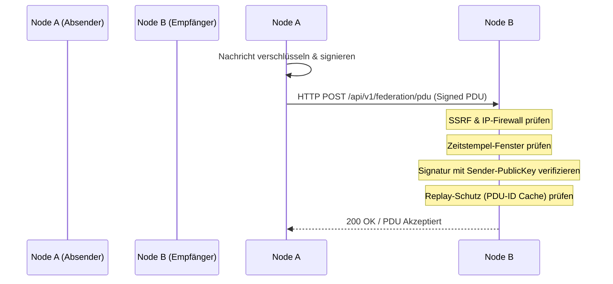

# GaiaCom — Post-Quantum Secure Federated E2EE Infrastructure

[](https://golang.org)
[](https://nodejs.org)
[](#)
[](#)

GaiaCom ist eine dezentrale, föderierte Kommunikationsplattform mit nativer Ende-zu-Ende-Verschlüsselung (E2EE) und zukunftssicherer, hybrider Post-Quanten-Kryptografie. Das System schützt Unterhaltungen, Gruppen-Chats und Dateidrops vor externen Angreifern, kompromittierten Server-Knoten und zukünftigen Quantencomputern.

---

## 1. Architektur & Kernfunktionen

GaiaCom basiert auf einer verteilten Multi-Knoten-Architektur, bei der die Datensouveränität vollständig beim Nutzer liegt.

### Hauptkomponenten
1. **Frontend (React)**: Ein hochgradig modularisiertes Web-Frontend. Die Benutzeroberfläche nutzt ein schickes Dark-Mode-Cyberpunk-Design mit geteilten Panels und responsivem Hamburger-Menü. Die kryptografischen Operationen werden direkt im Browser des Benutzers ausgeführt.
2. **Backend (Go)**: Ein leichtgewichtiges, schnelles Go-Backend, das API-Anfragen bedient, Daten persistent speichert und Föderations-Anfragen verarbeitet. Es nutzt eine pure Go-Implementierung von SQLite (`modernc.org/sqlite`) für minimale Abhängigkeiten.
3. **Kryptografische Engine**: Nutzt einen hybriden Ansatz aus **ML-KEM-1024** (Post-Quanten-Kryptografie) und **X25519** (Elliptische Kurven), um Nachrichten und Metadaten zu verschlüsseln.

### Features
*   **Post-Quanten E2EE**: Verschlüsselung von Direktnachrichten (Chats), Gruppen-Chats und Dateiübertragungen.
*   **GaiaVault**: Ein passwortgeschützter, Client-seitig verschlüsselter Datensafe im Browser (PBKDF2-abgeleitete Schlüssel) zum Speichern von Anmeldedaten und privaten Schlüsseln.
*   **GaiaDrop**: Anonymes, hochsicheres Filesharing-System mit automatischen Ablaufzeiten und Ratenbegrenzung.
*   **TrustMesh & TrustPassport**: Ein dezentrales Konsenssystem zur Missbrauchs- und Spam-Erkennung anhand von Reputations-Scores, ohne die Privatsphäre der Nutzer zu gefährden.
*   **SMTP-Bridge**: Ein dediziertes Eingabe-Gateway für den Empfang und Versand klassischer E-Mails, visuell getrennt von sicheren GaiaCom-Nachrichten.

---

## 2. Dokumentations-Index

Ausführliche Beschreibungen des Protokoll-Designs und der Bedrohungsmodelle finden Sie im Ordner [`docs/`](docs/):
*   [Protocol Specification v0.1](docs/protocol-v0.1.md) — Details zu hybriden X25519/ML-KEM Kombinierern, AAD Binding und Signatur-Serialisierung.
*   [Threat Model](docs/threat-model.md) — Erläuterung der Systemgrenzen, STRIDE-Kategorien und Mitigierungen.
*   [Security Invariants](docs/security-invariants.md) — Sicherheits-Invarianten, die durch unsere Test-Suite verifiziert werden.
*   [Beta Known Limitations](docs/beta-known-limitations.md) — Einschränkungen der Beta-Version und Sandbox-Grenzen.
*   [Abuse Consensus](docs/abuse-consensus.md) — TrustMesh Score-Decay und Friction-Policies.
*   [Responsible Disclosure](docs/responsible-disclosure.md) — Richtlinien zur Einreichung von Sicherheitsberichten.

---

## 3. Wie Föderation (S2S) funktioniert

Die Föderation ermöglicht es verschiedenen eigenständigen Servern (Nodes), sicher miteinander zu kommunizieren.



### Sicherheits-Schutzschichten bei der Föderation:
1. **Protocol Data Units (PDUs)**: Jede föderierte Interaktion wird als PDU serialisiert, die kryptografisch mit dem privaten Schlüssel des sendenden Knotens signiert ist.
2. **SSRF- & DNS-Rebinding-Firewall**: Beim Verbindungsaufbau zu anderen Servern blockiert das Go-Backend Anfragen an `localhost`, private IP-Bereiche (RFC 1918) und DNS-Umleitungen in lokale Subnetze.
3. **Replay-Schutz**: Empfangene PDU-IDs werden in einem Cache vorgehalten. Identische PDU-IDs innerhalb des Gültigkeitsfensters werden sofort verworfen.
4. **Zeitstempel-Validierung**: PDUs werden abgelehnt, wenn deren Zeitstempel zu weit in der Vergangenheit oder Zukunft liegt, um Time-Drift- und Replay-Angriffe abzuwehren.

---

## 4. Manuelle Konfiguration (Umgebungsvariablen)

Um die Backend-Dienste vollständig in Betrieb zu nehmen, müssen folgende Umgebungsvariablen konfiguriert werden:

### Core- & API-Konfiguration
| Variable | Standardwert | Beschreibung |
| :--- | :--- | :--- |
| `GAIACOM_DEV_MODE` | `false` | Aktiviert den Entwicklungsmodus (erweiterte Protokollierung, lockere CSPs für Localhost). |
| `PORT` | `8080` | Port, auf dem das Go-Backend lauscht. |
| `GAIACOM_DB_PATH` | `data/gaiacom.db` | Pfad zur SQLite-Datenbank. |
| `JWT_SECRET` | *(Generiert)* | Geheimschlüssel für Session-Tokens. Muss in Produktion gesetzt werden! |

### SMTP-Bridge (Legacy Fallback)
Das Interface markiert SMTP-Interaktionen explizit als unsicher und unverschlüsselt. Für die Anbindung an Mail-Gateways konfigurieren Sie:

| Variable | Pflichtfeld | Beschreibung |
| :--- | :--- | :--- |
| `GAIACOM_SMTP_HOST` | **Ja** | Postausgangsserver (z.B. `smtp.gmail.com` oder `mail.gaiacom.de`). |
| `GAIACOM_SMTP_FROM` | **Ja** | Absender-E-Mail-Adresse der Bridge (z.B. `bridge@gaiacom.de`). |
| `GAIACOM_SMTP_PORT` | Nein | SMTP-Port (Standard: `587` bei TLS-Start). |
| `GAIACOM_SMTP_USERNAME` | Nein | Benutzername zur Anmeldung (leer lassen, wenn keine Auth nötig). |
| `GAIACOM_SMTP_PASSWORD` | Nein | Passwort zur Anmeldung. |
| `GAIACOM_SMTP_INGEST_TOKEN` | Nein | Token zur Authentifizierung eingehender Mails in den SMTP-Eingang. |

---

## 5. Lokale Entwicklung & Tests

### Clean Copy Build (Lokale Verifikation)
Um das System ohne Altlasten, lokale Caches oder geheime `.env`-Dateien lokal zu bauen und zu verifizieren:

1. **Projekt säubern & kopieren** (Exkludiert Binaries, `node_modules` und lokale DBs):
   ```powershell
   robocopy . ..\GaiaCOM_CLEAN_VERIFY /E /XD node_modules build dist .git .idea .vscode tmp temp logs data __pycache__ /XF *.exe *.dll *.so *.db *.sqlite *.sqlite3 *.log .env .env.local .env.production gaiacom-backend gaiacom-backend-linux-amd64
   ```
2. **Build-Cache leeren**:
   ```bash
   go clean -cache
   ```
3. **Backend-Tests & Kompilierung**:
   ```bash
   cd Backend
   go test ./...
   go build -o gaiacom-backend.exe .
   ```
4. **Frontend-Tests & Kompilierung**:
   ```bash
   cd Frontend/frontend
   npm ci
   npm run build
   node src/adversarial_run.mjs # Führt die 44 kryptografischen Frontend-Prüfungen aus
   ```

---

## 6. Security Scans & Best Practices

Im Quellcode sind folgende Sicherheitsrichtlinien implementiert:
*   **Kein `dangerouslySetInnerHTML`**: Eingaben werden strikt gefiltert, um Cross-Site Scripting (XSS) zu verhindern.
*   **Keine lokalen IP-Leaks**: Der Production-Build blockiert alle Localhost-Pfade.
*   **Explizite Warnungen**: SMTP-Interaktionen blenden dem Nutzer zwingend eine Warnung ein, dass SMTP keinen Post-Quanten-Schutz und keine E2EE bietet.
